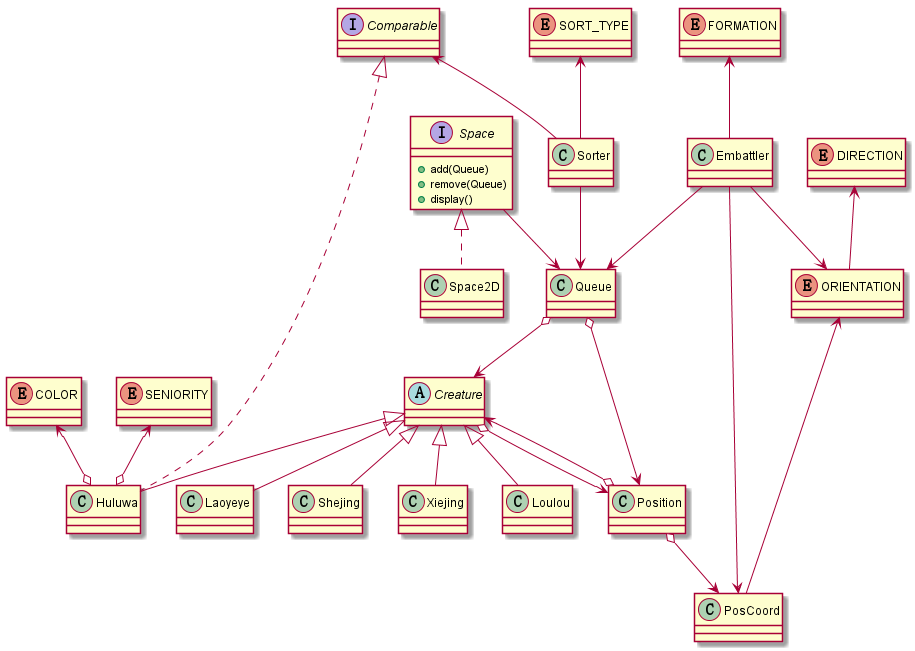

# 葫芦娃编程相关设计
## 各个类及其关系
### 主要的类和接口
- Creature 类是所有生物的抽象基类
- Comparable 定义了对象比较的接口
- Space 接口包含增加、删除 Queue 对象以及把所有
Queue 对象中包含的 Creature 对象按照其 Position
信息显示出来
- Space2D 是 Space 接口的二维形式的一个实现
- Huluwa 类继承了 Creature 并实现了 Comparable
 接口
- Laoyeye、Xiejing、Shejing 和 Louluo 分别代表蝎子精、
蛇精和小喽啰，都继承了 Creature
- PosCoord 表示坐标信息
- Position 表示一个位置，包括坐标及其上的生物
- Queue 表示包含一组位置的队列，可能有不同的队形
- Sorter 是排序器，可以将 Queue 中的生物进行排序
- Embattler 类表示布阵器，可以将 Queue 布置成
不同的阵型
### 用到的 Enum 类
- ORIENTATION 表示绝对方向，如东南西北
- DIRECTION 表示相对方向，如左、右和后
- FORMATION 是不同阵法名字的枚举
- SORT_TYPE 是不同排序方法的枚举
- COLOR 和 SENIORITY 是葫芦娃属性值的枚举
### 类图（主要的关系）

## 设计想法
### TODO

