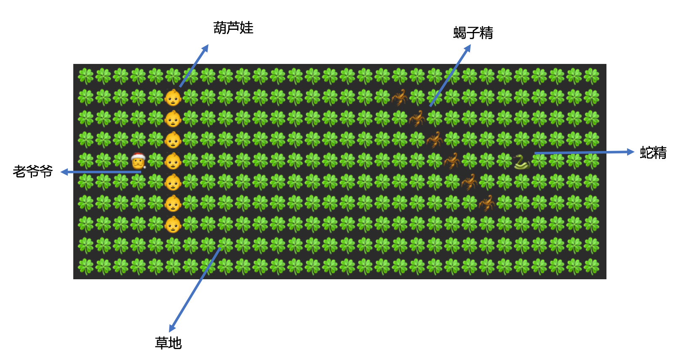

####1.面向对象
本次作业我实现的思路是：  

* 类`Field`表示整个战场，由`20*30`个单位战场组成，单位战场由类`Field_Unit`描述，`Field`与`Field_Unit`之间是聚集关系；
	* `Field`的构造方法初始化战场大小，并设置每个单位战场为草地`Grass`；
	* `Field`包含插入/移除一个阵型（由类`Formation`描述）和打印战场等方法；
* 类`Field_Unit`包含成员对象位置`location`和`creature`，分别由类`Location`和`Creature`描述，他们之间的关系也是聚集；
* `Creature`为一个抽象类，它的子类型有：`Grass`（草地）,`Huluwa_Entity`（葫芦娃）,`Scorpion_Entity`（蝎子精）,`Grandpa_Entity`（老爷爷）和`Snake_Entity`（蛇精）；
* `Formation`也是一个抽象类
	* 它包含成员：单位战场的集合`field_units`，`field_units`用`Vector`实现，包含了一个阵型里的所有生物和他们所在的位置；
	* 它的子类有：`Snake_formation`（长蛇阵型）,`Goose_formation`（雁行阵型）,`Crane_formation`（鹤翼阵型）和`Single_formation`（单个生物）
* 类`Battle`中实现`main`方法，`main`中的主要操作是：新建战场对象、新建阵型、将阵型插入战场和打印战场。 
* 根据上述描述，类`Field`，`Field_Unit`和`Location`/`Creature`之间为聚集关系，类`Creature`和`Huluwa_Entity`...之间为继承关系，类`Formation `和`Snake_formation `...之间为继承关系；  
* `Field`的方法`void insert_formation(Formation formation)`和`Formation`各个子类的含参构造函数中用到了多态的思想。

####2.集合&泛型
对若干单位战场的集合的实现采用的是`Vector<Field_Unit>`，对若干生物的集合的实现采用的是`Vector<Creature>`，在`Formation`子类的构造函数中，用到了通配符`? extends Creature`解决存放生物的数组存放葫芦娃的问题。

####3.接口&异常
对类`Creature`实现了接口`Cloneable`用来完成生物对象的浅拷贝，同时对`clone`方法的调用进行了异常处理。

####4.运行结果
葫芦娃长蛇阵型与蝎子精雁行阵型:
 
葫芦娃长蛇阵型与蝎子精鹤翼阵型： 
 
