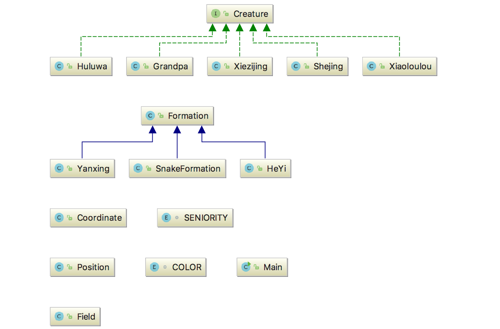
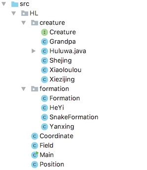

# 第三次作业 

  冯一洲   151220026  

#### 1、面向对象的概念

​	将现实世界的事物抽象成对象，现实世界中的关系抽象成类、继承，从而模拟显示世界。

#### 2、面向对象的机制

##### （1）封装

​    	隐藏对象的属性和实现细节,仅对外公开接口。如作业中各个类的public方法都相应地`封装`了部分代码，可以在外部接口不变的情况下修改内部实现，并且实现不暴露给外界。

##### （2）继承

​	继承就是子类继承父类的特征和行为，使得子类对象具有父类的实例域和方法，便于重用父类代码。在本例中`Huluwa`、`Grandpa`、 `Shejing`、 `Xiezijing`、`Xiaoloulou`都继承一个接口`Creature`，说明他们具备一些相同的属性，那么对这些属性的代码就可以复用。

##### （3）多态

​	多态是指程序中定义的引用变量所指向的具体类型和通过该引用变量发出的方法调用在编程时并不确定，而是在程序运行期间才确定。如`Field`类中有方法`public void setCreature(Creature creature, Position p)`  这里的形参`creature`具体是哪个子类型不清楚，需在运行时才能确定，使代码可以复用而不必对每一个子类型都实现一份代码。

#### 3、设计理念

文件组织利用package

（1）`Huluwa` `Grandpa` `Xiezijing` `Shejing` `Xiaoloulou` 均实现接口`Creature`

（2）`Yanxing` `SnakeFormation` `HeYi` 继承基类`Formation` 

（3）二维空间定义在`Field`类中，管理一个N * N的`Position`	

（4）布阵由`Formation`及其子类完成

###
