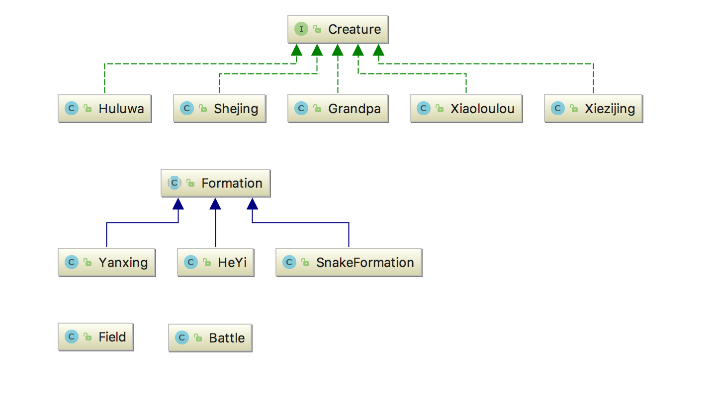
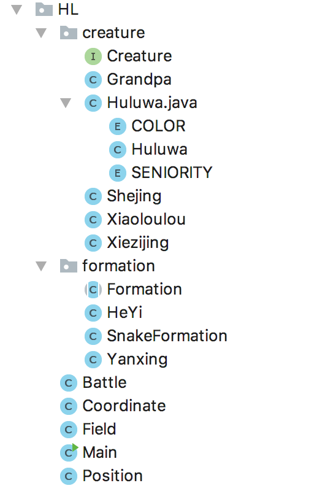

# 第三次作业 

  冯一洲   151220026  

#### 1、面向对象的概念

​	将现实世界的事物抽象成对象，现实世界中的关系抽象成类、继承，从而模拟显示世界。如将生物们的公共操作抽象为`Creature`接口，将整个空间抽象为N * M个`Position` 

#### 2、面向对象的机制

##### （1）封装

​    	隐藏对象的属性和实现细节,仅对外公开接口。如作业中各个类的public方法都相应地`封装`了部分代码，可以在外部接口不变的情况下修改内部实现，并且实现不暴露给外界。如`Creature`中有所有生物的公共操作`report()`，外部类只能使用这个方法，而不能\不应该知道其内部是怎么实现的。

##### （2）继承

​	继承就是子类继承父类的特征和行为，使得子类对象具有父类的实例域和方法，便于重用父类代码。在本例中`Huluwa`、`Grandpa`、 `Shejing`、 `Xiezijing`、`Xiaoloulou`都继承一个接口`Creature`，说明他们具备一些相同的属性，那么对这些属性的代码就可以复用。`Formation`的几个子类继承于`Formation`表示他们都可以排兵布阵；同时也有`Comparable`接口表示这是一个可比较的事物，所有可比较的事物只要实现了这个接口就可以在程序中比较了。

##### （3）多态

​	多态是指程序中定义的引用变量所指向的具体类型和通过该引用变量发出的方法调用在编程时并不确定，而是在程序运行期间才确定。如`Field`类中有方法`public void setCreature(Creature creature, Position p)`  这里的形参`creature`具体是哪个子类型不清楚，需在运行时才能确定，使代码可以复用而不必对每一个子类型都实现一份代码；`Foramtion`抽象基类中有`formation()`方法，基类不关心怎么实现，具体实现由子类去完成，实现了代码复用。

#### 3、设计原则

##### （1）SRP单一职责原则

每个类只做一件事，例如`Formation`就只对生物们排兵布阵，`Sorter`就只对葫芦娃排序，这两个类修改内部实现则另一个不会发生改变。

##### （2）OCP开放封闭原则

`Creature`接口的拓展只要添加public接口并由具体子类去实现即可，`Creature`提供的公共方法就是一个template method。

##### （3）LSP LISKOV替换法则

各个具体的生物其实都可以用`Creature`来替换，这也正是程序所做的事情。

##### （4）ISP 接口隔离原则

每个接口都不会依赖于别的方法

##### （5）DIP 依赖倒置原则

每个实际的生物类都直接依赖于接口`Creature`

#### 4、好处

设计过程模拟真实事件，自然简洁

便于代码复用、重构很方便

封装、访问控制减少了数据不小心被修改的可能

多态使得拓展性良好

类之间低耦合，高内聚，结构清晰

#### 4、 设计理念

#####  	1、UML图

#####	2、文件组织利用package

（1）`Huluwa` `Grandpa` `Xiezijing` `Shejing` `Xiaoloulou` 均实现接口`Creature`

（2）`Yanxing` `SnakeFormation` `HeYi` 继承抽象基类`Formation` 并覆写抽象方法`formation()`

（3）战斗由`Battle`创建，`Battle`里有葫芦娃、爷爷、蝎子精、小喽啰和一个场景`field`

（3）二维空间定义在`Field`类中，管理一个N * N的`Position` 场景的输出由`Field`完成

（4）布阵由`Formation`及其子类`HeYi` `SnakeFormation` `Yanxing` 共有的`formation()`方法完成

#### 5、主要逻辑

​	由Main()开始，创建一个`Battle`，`Battle`会初始化一个`field`并添加各种生物物，`BattleStart()`将会调用`Formation`的几个派生类对象来对生物们进行排兵布阵，然后由`field`输出

#### 6、效果展示

