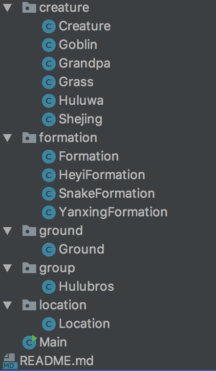
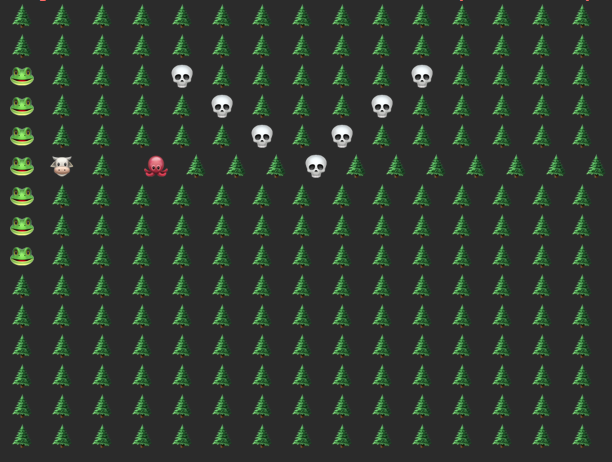
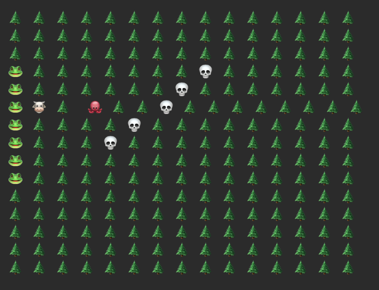

# 作业:面向葫芦娃编程
# 面向对象的设计
作业目录结构如下图：

## creature
Creature:
父类, 其他类均继承自Creature.(之所以用继承不用接口，是因为这些类均含有父类Creature的成员变量name, location.)

Goblin: 小喽啰

Granpa: 爷爷

Grass: 草坪

Huluwa: 葫芦娃

Shejing: 蛇精

## formation
Formation:
是所有阵法的父类, 包含成员变量:
`
int height, int width, Creature[][] contents.
`

HeyiFormation:
鹤翼阵, 继承自Formation, height, width定义了阵法的高宽, creature中包含了Location的信息.用一个Creature数组可以初始化特定阵法.

...Formation:略

## groud
Ground:
场地类, 可以添加Formation以及单个Creature, 并展示出来

## location
Location:
位置类, 记录了每个Creature的位置信息.

# 运行结果
结果一：

结果二:

