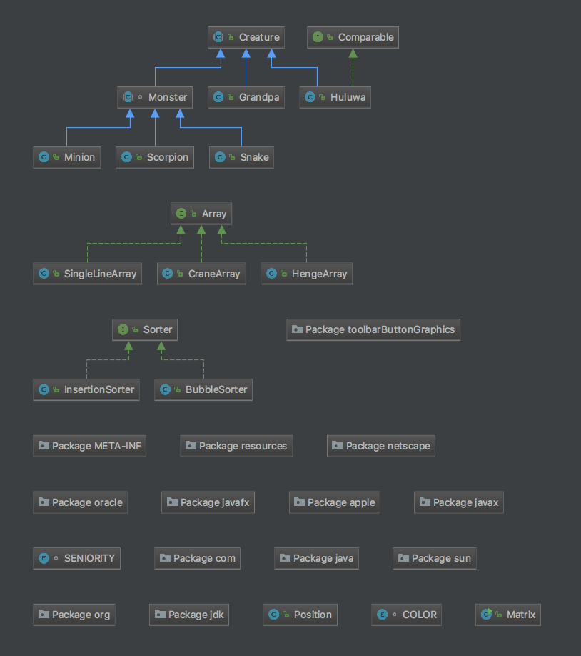

# 说明文档

------
## 设计理念

基于example，做了功能拓展
1. example中的**Creature**是作为接口，这次作业中生物的不少方法都是一样的，就把**Creature**作为抽象类处理了。
2. 使用了一个阵型加载器接口**Array**,其包含一个`rank()`方法，长蛇阵**SingleLineArray**、衡轭阵**HengeArray**、鹤翼阵**CraneArray**实例化**Array**。
3. 矩阵类**Matrix**管理一个Position的二维数组，构造函数`Matrix()`初始化战场，`show()`打印战场状况，`addcreature(Creature character,int x,int y)`在指定位置添加,`addcreature(Creature character)`实现随机在空position上添加creature。
4. 调用`SingleLineArray().rank(brothers,matrix)`让葫芦娃列阵长蛇阵，具体实现是先令brothers排成一列，然后调用`BubbleSorter().sort()`进行排序，有关排序**Sorter**在example中已经实现，就不赘述。
5. 调用`HengeArray().rank(minions,matrix)`让小喽啰列阵衡轭阵，调用`CraneArray().rank(minions,matrix)`让小喽啰列阵鹤翼阵(阵型加载器**Array**是学的**Sorter**)。
6. 把妖精抽象成了**Monster**,蝎子精**Scorpion**、蛇精**Snake**、小喽啰**Minion**都继承自**Monster**,虽然目前**Monster**还没有特殊的方法，但将其从**Creature**中抽象出来更符合OO的设计理念。

## 面向对象概念和机制

1. **Creature**作为抽象类处理，`setPosition()`, `getPosition()`等函数是共通的。爷爷和葫芦娃都继承自**Creature**。从**Creature**再抽象出妖精类**Monster**，蝎子精、蛇精和小喽啰继承自**Monster**。
2. 排序接口**Sorter**具体实现了冒泡排序`BubbleSorter`和插入排序`nsertionSorter`,排序将在葫芦娃列阵长蛇阵时使用。
3. 阵型接口**Array**具体实现了长蛇阵`SingleLineArray`、衡轭阵`HengeArray`和鹤翼阵`CraneArray`。

### 贴一张类图

