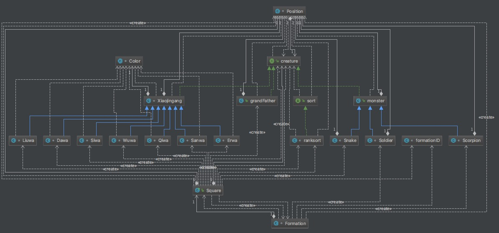

## 首先是整个的输出

## 然后是整个的结构图

## 综述
使用了``接口``、``继承``、``聚合``的面向对象概念。如上图所示。 
#### 接口
因为``sort``、``creature``、``compare``均为生物类需要进行继承的，因此抽象为借口，然后每个不同的生物进行实现，减少代码，增加逻辑性。使得整个的区域可以放下不同的实现，但是都是同一个父类。
#### 继承
考虑到以后可能需要的东西，我创造了``monster``和``Xiaojingang``两个大的类，实现了``creature``然后让各自的葫芦娃、蝎子精、蛇精、小喽啰等进行继承，简化了代码。
#### 聚合
因为``Square``类是整个的区域，需要``position``进行聚合，还有``creature``，然后每个``position``上有``creature``。这样能够使得层次更加清晰。而且Square上能够放入多种生物。 
因为需要进行阵的变换，因此``Formation``只有``monster``的类型才能够获取。 
其实最重要的是看上面的结构图啦～
祝老师天天开心～
