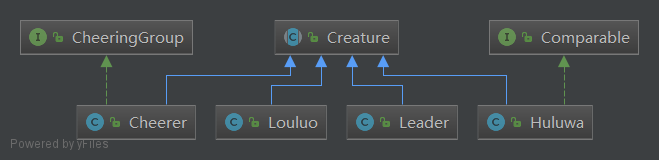

# 二维葫芦娃
## 先讲个故事
起初，神创造各种生物。<br>
后来，出现了两股势力，葫芦娃和爷爷加入了名为“葫芦娃”的势力，蝎子精蛇精和小喽啰们加入了“妖精”势力。<br>
于是神创造了一方场地来给两股势力作战场。<br>
两方势力来到这片天地，开始布阵。<br>
葫芦兄弟们自发组成了一个队伍，来对他们的站位进行排序。<br>
妖精们随即变换了阵型。<br>
......<br>

```
/* 初始化所有生物 */
        //葫芦娃
        Huluwa[] HuluBrothers = new Huluwa[7];
        for (int i = 0; i < HuluBrothers.length; i++) {
            HuluBrothers[i] = new Huluwa(COLOR.values()[i], SENIORITY.values()[i]);
        }
        // 爷爷
        Cheerer YeYe = new Cheerer("爷爷");
        // 蛇精
        Cheerer SheJing = new Cheerer("蛇精");
        // 小喽啰
        Louluo[] lackeys = new Louluo[10];
        for (int i = 0; i < lackeys.length; i++) {
            lackeys[i] = new Louluo(TianGan.values()[i]);
        }
        // 蝎子精
        Leader XieZiJing = new Leader("蝎子精");


        /* 初始化各方势力 */
        Troop powerOfHuluwa = new Troop(5, "葫芦娃", 0, -1);
        Troop powerOfYaojing = new Troop(5, "妖精", 0, 4);

        /* 所有人物加入势力 */
        powerOfHuluwa.addCreatures(HuluBrothers);
        powerOfHuluwa.addOneCreature(YeYe);

        powerOfYaojing.addCreatures(lackeys);
        powerOfYaojing.addOneCreature(SheJing);
        powerOfYaojing.addOneCreature(XieZiJing);

        /* 初始化场地，11*11方阵，可容纳2方势力 */
        Field field = new Field(11, 2);

        /* 各方势力登场 */
        field.addTroop(powerOfHuluwa);
        field.addTroop(powerOfYaojing);


        /* 各方势力布阵 */
        powerOfHuluwa.setFormation(FormationName.长蛇);
        powerOfYaojing.setFormation(FormationName.锋矢);

        /* 使用queue管理待排序的成员 */
        Queue queue = new Queue(HuluBrothers);

        queue.shuffle();    //  打乱
        field.show();

        new QuickSorter().sort(queue); //  冒泡排序
        field.show();

        /* 妖精变换阵型 */
        powerOfYaojing.setFormation(FormationName.偃月);

        field.show();
```
## 面向对象
### 委托机制
由于阵型信息的读取实现起来是一个相对独立的功能，所以有一个专门的FormationManager类来管理阵型。当某一方势力需要调整阵型，只需要向FormationManager提供阵型的名字，就可以得到相应的阵型的排布。<br>
这样可以把管理生物位置的方法和管理阵型的方法给拆分开来。<br>
### 代码复用
之前一维的葫芦娃的代码实现了Queue和Sorter，可以几乎不加改动地复用到二维的版本。因为采用了Creature这个抽象类，所有需要排序的生物加入到某个Queue中，就可以用Sorter进行排序。<br>
而且就算葫芦娃站的不是长蛇阵，也可以通过比较Position的位置进行排序。<br>
## 代码详细说明
### 人物类
所有登场人物所属的类都在名为Characters的package中。类图如下：
<br>
##### Creature
Creature在这里是一个抽象类，因为在场地中的每个生物都会占有一个Position，而将生物移动位置的功能是现在可以确定的。<br>
每个Creature还有自己所属的阵营。<br>
Creature中有一个抽象方法是report，用来显示位置。
还有一个act（）方法，用来进行不同生物的特有行为，因为目前只有爷爷和蛇精有特殊行为（即为己方势力加油助威），所以只有他们需要复写父类的act（）方法。<br>
##### Cheerer
这个类遵循了名为CheerGroup的接口，会依据自己所属的阵营来进行加油助威。当前程序中，爷爷和蛇精都属于这个类，因为他们的行为是一样的。<br>
##### Leader
Leader是一种生物，有名字，暂时只会站着，并没有特殊行为。蝎子精属于这个类。<br>
##### Louluo
小喽啰，是一种生物,没有名字，只有代号。<br>
##### Huluwa
葫芦娃与前一版的没有不同，与其他生物最大区别在于遵循了Comparable接口，以及在与其他生物交换位置时会报数。<br>
### 布局类
##### Queue, Sorter
这些几乎没有修改，并且在对二维空间的葫芦娃进行排序时可以复用。<br>
##### FormationManager
管理所有的阵型，包括每种阵型的默认Leader位置，默认Cheerer位置，阵型布局（二维布尔数组表示）。<br>
暂时成员变量来存储阵型。后续改进时会改为从文件中读取。<br>
##### Troop
表示一方势力，目前有两个示例，即葫芦娃和妖精。<br>
这里面包括了阵营的成员（葫芦娃或者小喽啰），领导者（蝎子精）和负责加油助威的啦啦队（爷爷或者蛇精）。<br>
每个Troop有一个FormationManager，每次设置阵型时，先通过阵型名字从FormationManager那里获得阵型的分布，然后通过调用成员的moveTo（）方法来设置每个成员的站位。<br>
每个Troop有一个anchor坐标，读取到的阵型信息中是成员在己方势力中的相对位置，相对位置坐标加上anchor坐标才是这个生物在实际场地中的坐标。
### Field类
故事发生的二维空间，拥有一个二维Position数组，和若干个Troop.<br>
### Types
##### 枚举
几个枚举类型，用来表示颜色、阵型、葫芦娃排行、妖精甲乙丙丁等。<br>
##### Vector2
二维向量，用于表示位置坐标信息。
### Position
将原本的int x变量改为Vector2类型，来存储二维坐标。
