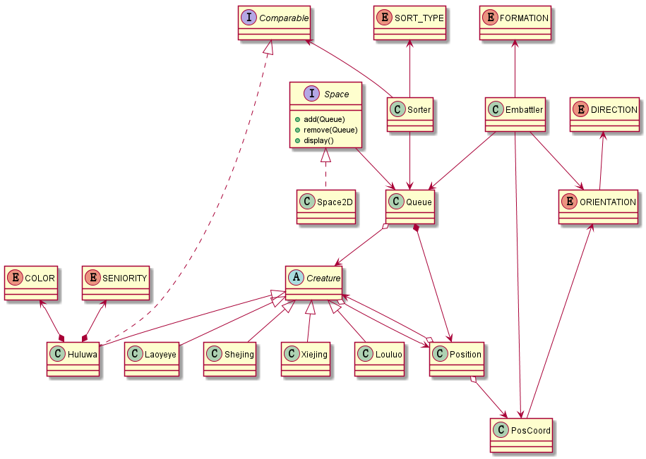

# 葫芦娃编程相关设计
## 各个类及其关系
### 主要的类和接口
Class| 解释
---|---
Creature|所有生物的抽象基类
Comparable| 定义了对象比较的接口
Space|空间，可以包含 Queue 并显示其中各个位置的 Creature
Space2D|Space 接口的二维形式的一个实现
Huluwa|葫芦娃继承了 Creature 并实现了 Comparable 接口
Laoyeye、Xiejing、 Shejing、Louluo|爷爷、蝎子精、蛇精和小喽啰，都继承了 Creature
PosCoord|坐标信息
Position|一个位置，包括坐标及其上的生物
Queue|包含一组生物及其位置的队列
Sorter|排序器，可以将 Queue 中的生物进行排序
Embattler|布阵器，可以将 Queue 布置成不同的阵型
### 用到的 Enum 类
Enum Class|解释
---|---
ORIENTATION|表示绝对方向，如东南西北
DIRECTION|表示相对方向，如左、右和后
FORMATION|不同阵法名字的枚举
SORT_TYPE|不同排序方法的枚举
COLOR、SENIORITY|葫芦娃属性值的枚举
### 类图（主要的关系）

## 设计想法
### 故事背景
1. 首先诞生的是 Space，Space 中能够容纳 Queue
并显示 Queue 的内容。现在我们只有二维版本的
Space，也就是Space2D。Queue 中有着一众 Creature，
以及供 Creature 站的 Position。每个 Position 都
有一个 Creature 占据并有一个位置坐标 PosCoord。
2. Creature 种类丰富，有 Huluwa、Laoyeye、Shejing、
Xiejing 和 Louluo，其中 Huluwa 是 Comparable 的。
3. Queue 中有众多 Creature 及其 Position，管理有点
麻烦，于是需要 Sorter 来帮忙排序以及 Embattler 来
帮忙布阵。Sorter 只对 Comparable 的 Creature 排序。
### 设计想法
#### 抽象类和接口
- 设计抽象类 Creature，所有生物继承自它。好处在于为
Queue 等提供统一的接口，可以方便地拓展更多具体生物
种类。
- 设计 Comparable 接口，使得 Sorter 不针对具体的
物体来实现，让 Sorter 可以适用于任何 Comparable的
物体。
- 把 Space 设计成接口，使得可以针对二维、三维等不同
具体的空间进行不同的实现，方便拓展。
#### 单一职责划分
- 脱离 Creature 抽象出 Position，让 Embattler 布阵
以及 Sorter 排序的时候只依赖于 Position，而不依赖于
Creature。
- 由于 Position 包含其上的生物以及位置坐标，为了
划分职责，从中分离出 PosCoord 单独表示位置坐标。
- Queue 表示一队 Creature 及其 Position 组成的队列，
其职责仅包含简单的 shuffle 和 rollCall 等，比较复杂
的职责如排序和布阵，则由 Sorter 和 Embattler 专门
负责。

