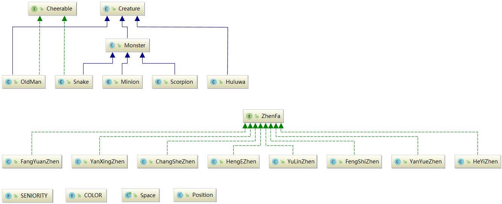

# 实验报告

## UML图


## 文件结构
这次作业文件众多，我将它们放在了不同的package中进行管理。
```
luyiming                    --> package luyiming;
├── creature                --> package luyiming.creature;
│   ├── Cheerable.java
│   ├── COLOR.java
│   ├── Creature.java
│   ├── Huluwa.java
│   ├── Minion.java
│   ├── Monster.java
│   ├── OldMan.java
│   ├── Scorpion.java
│   ├── SENIORITY.java
│   └── Snake.java
├── Position.java
├── Space.java
└── zhenfa                  --> package luyiming.zhenfa;
    ├── ChangSheZhen.java
    ├── FangYuanZhen.java
    ├── FengShiZhen.java
    ├── HengEZhen.java
    ├── HeYiZhen.java
    ├── YanXingZhen.java
    ├── YanYueZhen.java
    ├── YuLinZhen.java
    └── ZhenFa.java
```

## 代码剖析
- 葫芦世界中的所有人物都继承自 `Creature` 抽象类，为什么我没有像老师那样使用 `interface Creature` 的接口设计呢？有两方面考虑：
    1. `Creature` 中的某些方法，如 `setPosition(); getPosition()`，它的代码在子类中是通用的，因此设计成基类并在基类中提供实现可以实现代码的复用。
    2. 葫芦世界中人物具有一些共同的属性，如位置 `Position` 等，这些属性就可以放在基类中，并且设置成 `protected`，实现代码的复用。而接口中应该是不能放属性的？
- 葫芦世界中，所有的怪物有一个相同的基类 `Monster`，`Monster` 继承自 `Creature`。虽然目前 `Monster` 中没有任何方法和属性，但是我觉得为怪物们设计一个共同的基类有助于以后的拓展。
- 老爷爷和蛇精都有为各自阵营加油助威的能力，因此我设计了一个接口 `interface Cheerable`，表示拥有加油助威的能力，接口中的方法是`cheer()`。
- 葫芦世界中，阵法拥有改变阵型的能力，我觉得用接口来描述阵法具有的功能是非常合适的，因此我设计了接口 `interface ZhenFa`，接口中的方法是 `apply()`，表示施法。
- 代码中所有的属性都是 `private` 或 `protected` 的，访问属性通过 `setXXX` 和 `getXXX` 方法进行，有利于隐藏细节。
