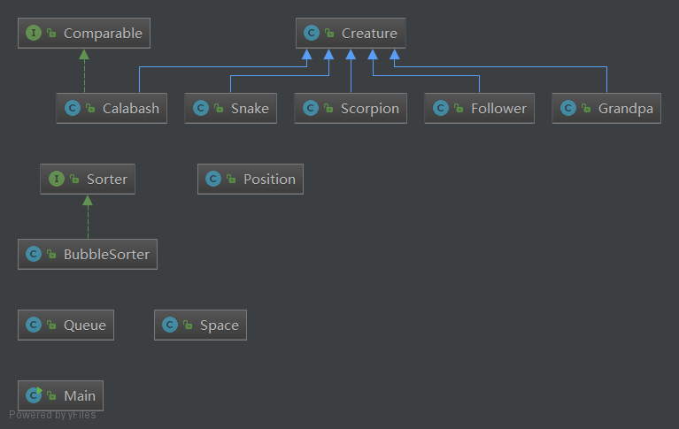

#一.代码框架

UML类视图如下： 
 

1. 与生物有关的类：Calabash、Grandpa、Snake、Scorpion、Follower均从父类Creature继承而来，用以实现各种不同的角色。 
2. 与空间有关的类:Position为二维空间中每个位置的类；Space为整个二维空间的类，用以实现不同阵型以及相关变化；Queue为队列的类，相比较于第二次作业，主要用于对葫芦兄弟进行排队。 
3. 其他类：Main为整个游戏的入口类，用以实现“上帝之手”；BubbleSorter具体实现冒泡排序算法。 
 
#二.设计理念

在研究了曹老师给出的第二次作业的代码的基础上，我选择了部分其中的精华在我的第三次代码中进行了使用，比如排序部分，定义了Sort这一接口，然后具体的排序算法由具体的类进行实现。 
 
下面是整个设计中，较为能够体现面向对象思想的部分： 

1. 继承的使用。Calabash、Grandpa、Snake、Scorpion、Follower均从父类Creature继承而来，作为父类的Creature仅有name一个成员，及其相关方法，具体的子类中，根据具体需要，可以添加不同的成员与方法，更有利于不同角色的实现。 
2. 接口的使用。将Sort定义为接口，在排序时有利于对不同的排序方法进行实现。同时，排序过程中的比较运算可能发生在不同的生物之间，因此定义了Comparable这一接口，有利于不同比较方式的实现。
Calabash、Grandpa、Snake、Scorpion、Follower均从父类Creature继承而来。 
3. 场景的模拟。涉及排队的地方用Queue类进行实现，整个空间内的场景就用Space进行实现，这样实际上就是从对象本身出发，更好地体现面向对象的思想。 
 

#三.不足之处

1. 作业里的Queue类只是针对作业实现设计的，长度固定，几乎没什么可移植性。 
2. 作业中为了简便起见，小喽啰的数量定义为了6个，阵型的设置不能随着小喽啰数量的变化而变化。 
3. 不同的阵型，应该可以用不同的类进行实现，简便起见，只实现了作业中要求的三种阵型。 
4. 控制台输出的结果......简单粗暴。 