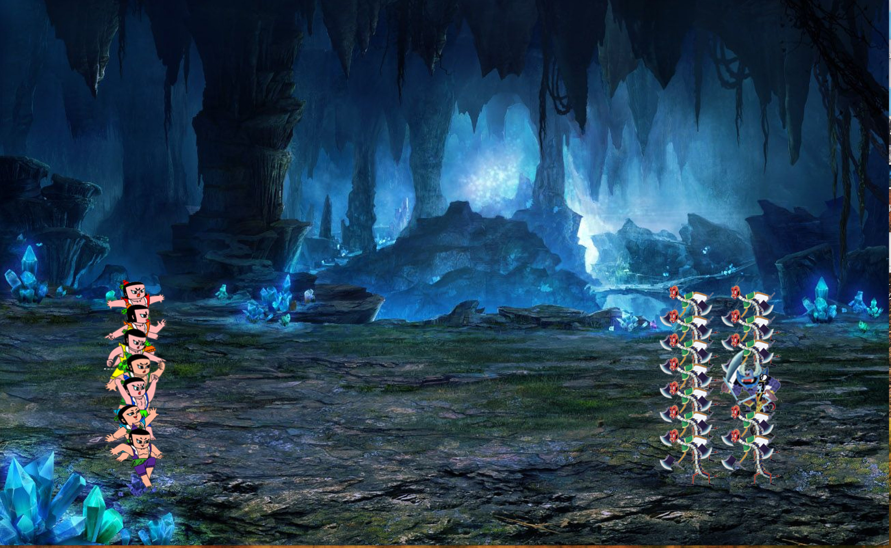
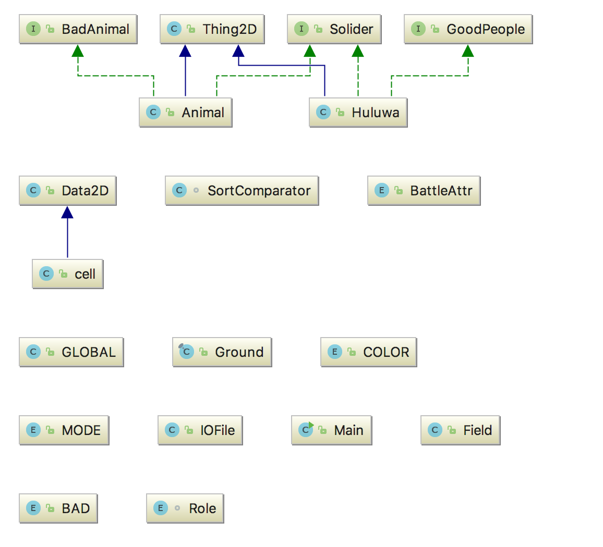
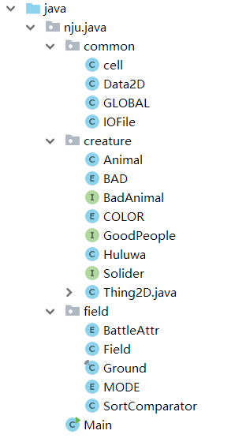

# 葫芦娃大战妖精说明
151220172 郑运辉
## 项目演示
### 起始界面

### 战斗过程

## 具体操作
由于有配置文件，用于定义葫芦娃和怪物的战斗值，还有演示的空间大小和刷新频率，因此需要在同一个jar目录下放入config文件，要先检查config文件是否存在。

在起始界面按空格开始，按L选择文件进行导入。（只能每次重新打开程序进行观看，无法直接在演示完毕后观看）

其中记录文件会放在同目录下的document文件夹中，可选择其中一个观看。

## 项目构建
### 总体框架和继承关系及相关简介

将以上类和数据分为三个包，对项目进行整理

以下对每个包进行简要介绍
### common
用于管理公共类的包

+ cell：用于管理每个格子的信息，使处理角色之间的关系更加方便
+ Data2D：用于管理2维数据，如位置信息，图片大小信息等
+ GLOBAL：定义一些全局函数、变量
+ IOFile：用于文件的输入输出

### creature
用于管理每个生物体

#### enum
+ BAD：用于标记坏人的属性
+ COLOR：用于标记葫芦娃的颜色
#### interface
+ BadAnimal：坏人的行为接口，用于扩展
+ GoodPeople：好人的行为接口，用于扩展
+ Solider：战斗角色的行为接口，用于扩展
#### class 
+ Animal：好人
+ BadAnimal：坏人
+ Thing2D：所有生物的基类

### field
用于管理战斗场地的信息
#### enum
+ BattleAttr：用于标记每个格子的信息
+ MODE：用于标记整个程序进行的位置，有BEING、RECORD、REPLAY、OVER四个值
#### class
+ Field：管理整个场地信息
+ Ground：界面的容器
+ SortComparator：负责部分显示的排序

### TEST

用于测试一些小功能的三个类

+ FileChooserTest：用于测试文件选择界面是否正常，返回值是否正确
+ SerializationTest：用于测试序列化正确性，生成文件在documentTest中
+ SortComparatorTest：对排序进行测试

## 程序设计
### 封装
每个类只负责了自己有关的部分，具体可以参考上面的框架
### 继承
通过上面的介绍可以知道，Huluwa，Animal类继承了Thing2D类，有利于下面的多态实现
### 多态
由于Huluwa和Animal继承了Thing2D，因此在进行图像显示和文件存取的时候，可以直接利用ArrayList<Thing2D>来对这两种对象进行统一管理，简化了代码的实现。
### 异常处理
对所有需要进行异常处理的方法进行了异常处理
### 集合和范型
Huluwa和Animal统一用Arraylist进行管理
### 输入输出
IOfile中调用大量输入输出方法，不过没有用到序列化，理由见下。
### 设计原则
+ 单一职责原则：IOFile只负责了文件的读写
+ 里氏替换原则：Huluwa和Animal作为Thing2D的子类，在程序中可以直接替换Thing2D

## 遇到的问题
### 多线程
在进行多线程编程的时候感觉十分复杂...有时能够正确显示的程序，有时又出现难以理解的错误，鉴于时间的原因，程序还有一些bug

### 写文件
在实现写文件的过程中遇到许多问题，首先是序列化问题：  
为了解决该问题，首先写了个SerializableTest，专门用于测试写文件的问题。  
由于不知道image变量是不能够序列化的，找了许久才发现这个原因。  
一开始打算直接将fieldGround（葫芦娃和坏人用于判断移动的矩阵，只有SPACE\GOOD\BAD三个属性）存进文件中，但是在实现过程中发现该矩阵只能获得好人阵营和坏人阵营的信息，并不能完全获得在该位置的对象的具体信息。  
于是选择利用序列化，在实现过程中出现了许多错误..耗费大量时间后选择放弃该方法。  
最后采取使用存储每次的移动信息，死亡信息等关键信息的方式，实现回放功能。通过这种方式，完成了文件存取功能。

## 总结和心得
总体来说，程序还是存在着不少的问题，对于第一次接触多线程的我，对多线程多了一份恐惧，也多了一份期待。用单线程能够轻松完成的任务在多线程的加入后显得尤为复杂，这是对多线程的理解不够深刻，程序开发经验少导致的。这学期同时在上高级程序设计和java课程，在高级程序设计课上了解了面向对象的基本语法，原则，在java课上对面向对象有了进一步的了解。写程序还是要多实践；还没开始做大作业时，在看课件，看书的过程中，总是会心生疑惑：这有什么用？整这么复杂干什么？但是在完成大作业的过程中，深刻的体会到了设计模式和设计原则的重要性，也对面向对象有了新的了解。
