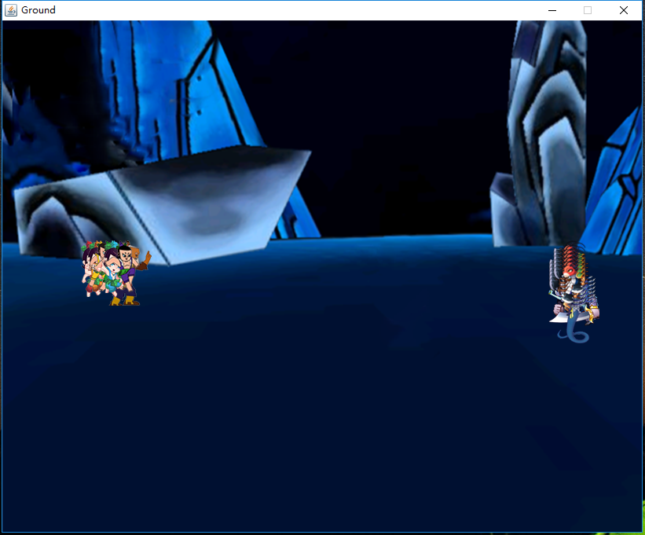
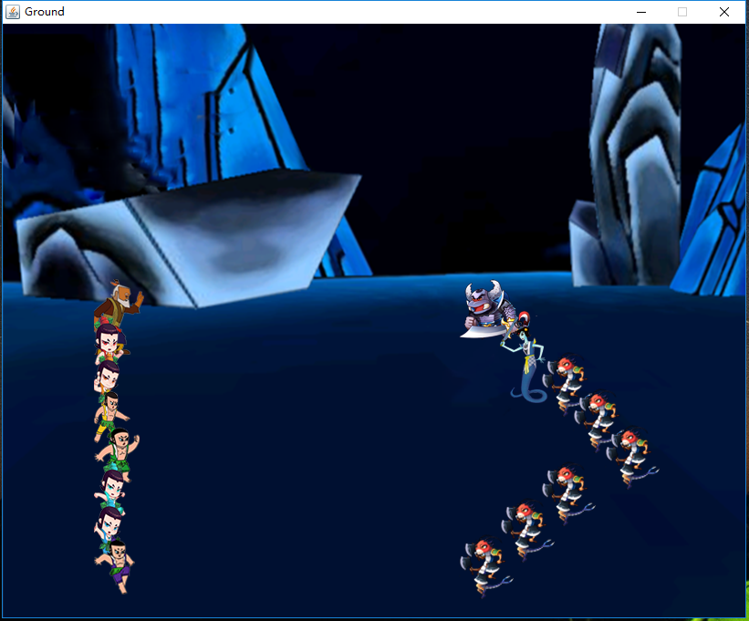
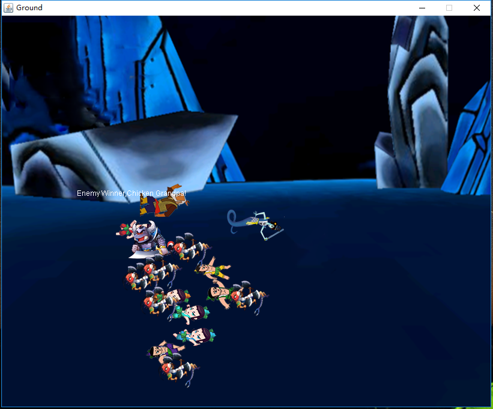
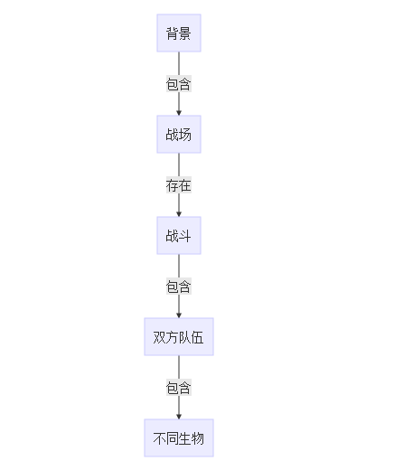
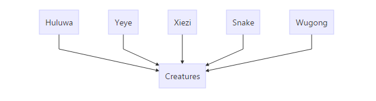

# 葫芦娃程序说明
本实验完成了一个葫芦娃与蛇精作战的程序
## 功能说明
本程序能够模拟葫芦娃队伍与蛇精队伍作战的场景，战斗开始前生成双方队伍的成员，分别站立到战场左上角和右上角，如下图

此时有两种选择，可以选择按下space键让双方队伍站成自己的队伍阵型，如下图

或者是按下L键选择文件播放

如果选择了战斗，战斗过程中会将战斗记录到D:\battle.txt文件中，战斗中途如果觉得战斗不精彩，可以按下ENTER键回到初始界面，战斗结束后可以按下L键并选择文件播放，或者是按下ENTER键回到初始界面。

战斗结束场景如下:

如果选择了播放文件，请选择按照正确形式记录战斗场景的文件播放，否则将无法播放，播放中途无法无法停止播放，请给葫芦娃最起码的尊重，看完整场战斗。播放完成后，可以选择按ENTER回到初始界面。
***
## 部分实现细节说明
### 模块间关系

### 生物类
此部分代码完全沿用了之前写过的葫芦娃程序，以Creature类为基类，派生出具体的类，结构如下图：

需要说明的是，写完之后发现基本上所有的工作都可以在Creature类里完成，没必要派生出这么多类。

### 背景类与战场类
背景中的一个区域被划为战场，所以背景类中包含战场类，而战场，作为一个场地，一个布景，负责全部的UI工作。

### 战场类和战斗类
战斗在战场上发生，所以战场类包含战斗类，战斗类负责处理双方队伍，以及整体的战斗状况，比如当前战士们的位置，是否需要战斗判断，战斗判断的结果等。

### 战斗类和队伍类
战斗类包含队伍类，队伍类负责排成阵型等操作

### 队伍类和生物类
队伍类中有一个Arraylist存着一方队伍的所有生物，生物类负责每个个体的生死，移动，是该程序运行的基本单位。
***
## 设计理念
**单一职责原则**  
当需要修改某个类的时候原因有且只有一个（THERE SHOULD NEVER BE MORE THAN ONE REASON FOR A CLASS TO CHANGE）。换句话说就是让一个类只做一种类型责任，当这个类需要承当其他类型的责任的时候，就需要分解这个类。从我的模块关系图中可以看得出该理念的运用。

**里氏替换原则**

当一个子类的实例应该能够替换任何其父类的实例时，它们之间才具有is-A关系，任何具体的生物类型都可以替换生物类型。

**依赖倒置原则**
1. 高层模块不应该依赖于低层模块，二者都应该依赖于抽象 
2. 抽象不应该依赖于细节，细节应该依赖于抽象
