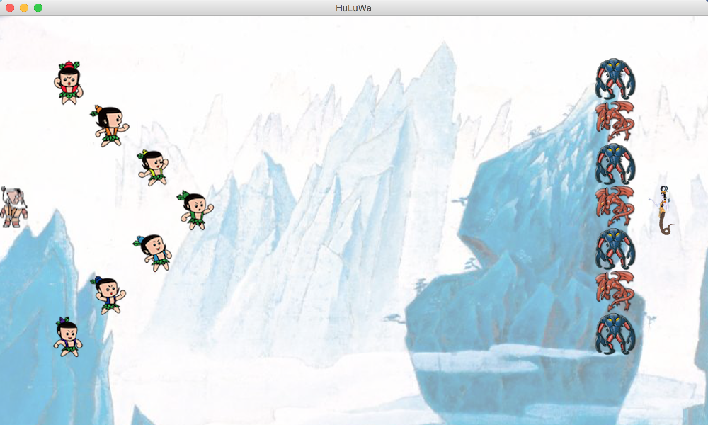
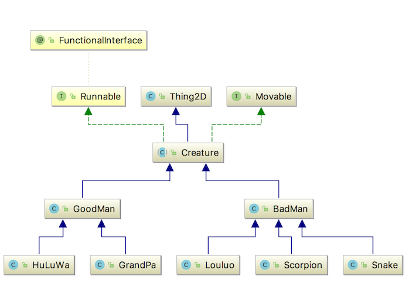

# 葫芦娃大战妖精   

#### 151220026    冯一洲    v1.0

### 前情提要

葫芦娃七兄弟在葫芦岛上生活了一个学期，跟随老爷爷学习本领，很快他们就从只会站成一对排序排序，到在广阔的草丛里排兵布阵，最终他们终于迎来了终极大BOSS的挑战，结果会是如何呢...

##### 操作方式：

1、按下`SPACE`键，游戏自动开始

2、开始前或者结束后按下`L`键，可以加载回档

3、按下`R`键重新布阵

### 一、类设计

1、`Main`是游戏的入口，将会创建一个`Game`类对象来建立游戏窗口；

2、`Game`类中会创建起来`Field`类对象，`field`是游戏场景发生的地方；

3、在`Field`中有包含了所有与游戏相关的人物与场景，是整个游戏的控制中心。

4、`Holder`是保存生物的容器，在`Field`中共有[N * M]个holder；

5、`Foramtion`类是对生物进行排阵的类，提供静态方法`HeYiformation`和 `Snakemation`分别对好人和坏人排兵布阵；

6、`God`是一个全能的上帝，也实现为一个线程。祂的主要功能是对UI进行刷新，并对整个局势做出判断，指挥生物们发动攻击；

7、`Record`和`Replay`实现游戏的记录和游戏的回放功能，在回放模式下，屏幕上的生物并不是`Creature`类的对象，而是`Item`类对象，因为这些生物实际上并没有在`field`上进行打斗，所以`Item`只继承自`Thing2D`；

8、`Creature`类是游戏中所有生物的基类；`Thing2D`、`Movable`分别定义了可以在屏幕上显示和可以在场景中移动的属性，`Creature`将继承`Thing2d`并实现`Movable`接口。

9、`Creature`类内部定义并实现了一些所有生物都具有的方法，如有关在场景中移动的函数`move()` ` moveTo()` `validMove()`，攻击敌人的方法`attackAt()` 等。

10、生物们分为好人阵营`GoodMen`和坏人阵营`BadMan`，`HuLuWa`和`GrandPa`继承`GoodMan`，`Snake`、`Scorpiondead`和`Louluo`继承`BadMan`，这样在游戏中就可以根据动态信息在不破坏抽象的情况下来区分一个基类的`Creature`对象是好人还是坏人

### 二、 游戏逻辑实现

#####1、多线程

所有的生物均是一个线程，同时还有一个UI刷新线程，生物们的线程之间需要相互同步，生物与UI刷新线程之间也应该有同步的关系，经过一番资料查询和对比，我决定采用`CyclicBarrier`来管理线程生物线程和UI刷新线程之间的同步，每一个生物线程在完成一轮状态更新后将会调用`CyclicBarrier`的`await()`方法挂起，等所有生物都结束一轮更新后，UI线程才会被唤醒，这样UI才能比较合乎逻辑地进行刷新；同时，上帝在这里出现，对当前局势进行判断，并给生物们的下一步移动提供一些建议，生物们有一定的概率考虑选择这个一定，当然，他们也有一定概率选择随机移动，或者干脆不移动。

生物在进入`run()`方法后，首先判断自己四周一格有没有敌人，有就发动攻击，没有再决定下一步往哪里进发；为了线程安全，所有关于位置信息、生物信息的访问都应该加以同步`synchorized`控制.

#####2、移动策略

在移动策略上，葫芦娃们很聪明，他们首先看x轴方向的敌人，有的话就选择敌人移动，没有的话然后再找最近的y轴上的敌人；妖精们很糊涂，只能在x轴上走来走去；如前所说，每一步生物都有一定概率选择移动策略给出的方向，也有一定概率选择随机移动或者不动。

##### 3、回放功能

回放功能可以说踩了不少的坑，`Record`类对象`recorder`在每次UI刷新时将每个生物的坐标、状态记录下来，然后再每轮游戏结束后进行写文件操作；回放也实现为一个线程，`Replay`类首先读取回放文件，将所有的局势信息都读入`ArrayList<Item>`，随后每次刷新时从里面读取16个生物的信息并显示出来。

### 三、 面向对象的设计原则

#####1、封装与抽象：

隐藏对象的属性和实现细节,仅对外公开接口。如作业中各个类的public方法都相应地 `封装`了部分代码，可以在外部接口不变的情况下修改内部实现，并且实现不暴露给外界。如`Creature`中有所有生物的公共操作，外部类只能使用这个方法，而不能\不应该知道其内部是怎么实现的。总体康佳沿袭了之前的一系列小作业，生物类的结构框架没有太大变化，只是充实了内容，新增了接口，这也体现了接口与实现分离的重要性。

##### 2、 SRP单一职责原则：

一个类应该只做一件事情，否则就要分开，譬如游戏中的排兵布阵交给了`Formation`完成，记录与回放交给了`Record`和`Replay`完成，这样修改`Field`类内部的一些实现时，这几个类可以保持不变。

#####3、OCP开放封闭原则：

新添加的生物实现给定的接口就可以走上战场

#####4、依赖倒置原则：

所有生物类都事实依赖于虚类`Creature`类，虽然中间有一个Good/BadMEN，但这只是为了动态地区分基类对象

#####5、里式替换：

所有生物类对象都可以用基类替换

#####6、装饰器模式：

文件IO时的一贯操作

##### 7、适配器模式：

响应键盘时的`TAapter`是一种适配器模式

##### 8、观察者模式：

“上帝“是局面的观察者，对凡间众生物耳语。生物们发动攻击是通过上帝来发动的，而不是自己就可以对其他生物产生影响；移动策略也是由生物发出请求，由上帝来给出，最后再交给生物执行的。

### 三、 后记

经过一学期的学习与最后这个大作业的磨练，我也发现了自身不少的不足，最严重的就是具有拖延症（。。。）。学习了一学期JAVA，最大的收获是面向对象的思想，以后不管是否还会用到JAVA这门语言，面向对象思想都有继续培养与贯穿的。

葫芦娃与妖精之间的故事就要告一段落了，那么我们路上再见！在此预祝二位老师新春快乐！

