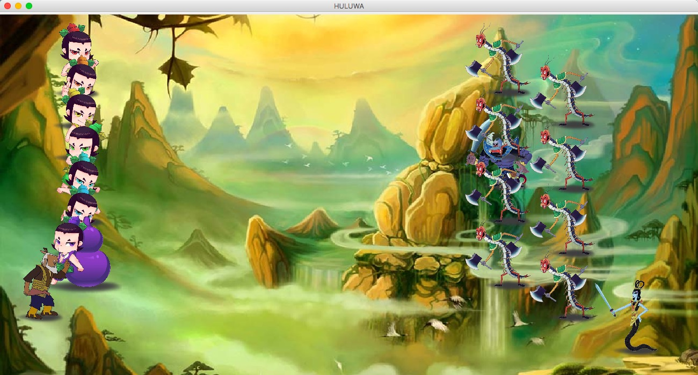

# 葫芦娃大战妖精-151220023

## UI界面



## 文件结构


## 综述

绘制了一个`1300 x 700`的二维空间，初始的时候七个兄弟和老爷爷在空间的左侧战队为一字长蛇阵。妖精（蛇精、蝎子精、小喽啰）在空间右侧战队为衡轭阵。以上各生物体均为一个线程。在初始化之后显示了界面，按空格键时所有生物体线程执行`run()`，向敌方前进；当某个生物体于敌方相遇（两者间的X轴距离和Y轴距离小于某个常量，在我的代码中使用的是`attackDistance`）时，选取一个概率决定双方生死，死者留下实体，生者寻找下一个敌人攻击；某一方生物全部死亡时，结束。为了战斗的精彩，葫芦娃有不尽相同的攻击办法，小喽啰有两次复活的机会。在工程实现过程之中利用了使用了``接口``、``继承``、``聚合``、`委托`的面向对象概念。如上图所示，并保证了线程安全。


## 面向对象

#### 接口

因为``sort``、``creature``、``compare``均为生物类需要进行继承的，因此抽象为借口，然后每个不同的生物进行实现，减少代码，增加逻辑性。使得整个的区域可以放下不同的实现，但是都是同一个父类。

#### 继承

考虑到以后可能需要的东西，我创造了``monster``和``Xiaojingang``、`grandFather`三个大的类，实现了``creature``然后让各自的葫芦娃、蝎子精、蛇精、小喽啰、爷爷等进行继承，简化了代码：

```java
class Xiaojingang<T> extends Player implements creature, Runnable {
  ...
}

class Dawa<T> extends Xiaojingang {
 ...
}
...
```

#### 聚合

因为``field``类是整个的区域，需要``Player``进行聚合，还有``creature``，然后每个``position``上有``creature``。这样能够使得层次更加清晰。而且能够放入多种生物。

```java
private Player dawa, erwa, sanwa, siwa, wuwa, liuwa, qiwa, scorpion, snake, grandfather;
```

#### 委托

通过`Player`类进行委托，实现了`Xiaojingang`和`monster`两个大类之间的消息传递，在结构之中互相不知道对方但是通过`Player`可以实现通信。

```java
Player nearestCanAttack = getNearestCanAttackPlayers(this.x(), this.y(), this.camp);
...
nearestCanAttack.setDeath();
...
```

#### 使用的设计模式

* 单一原则
* 适配器
* 迭代器
* 责任链

#### 容器

最新的更新使用了容器类，精简了葫芦娃的一部分内容。

## 多线程

使用了多线程的办法，多线程中出现的问题在下面所讲述问题以及解决办法中有涉及，处理了临界区可能发生的问题，比如对当前整个状态的获取，写文件的时候多线程都要写需要的控制流程等。

比如`CopyOnWriteArrayList`可以处理`List`中的临界区数据管理：

```java
    private CopyOnWriteArrayList<Player> soldiers = new CopyOnWriteArrayList<>();
```

比如使用`synchronized`可以使得获取当前世界状态的时候控制访问：

```java
    public synchronized CopyOnWriteArrayList<Player> getWorld() {
        return world;
    }
```


## 杂七杂八

#### 自动构建

使用了`maven`进行了整个工程的自动构建，可以完成打包并可以从`target`目录获取打包的`huluwa.jar`文件。

#### 异常处理

在所有可能出问题的地方都加入了异常处理，并且根据自己的代码继承了`Exception`类进行了自己的异常处理控制类。

```java
class FormationException extends Exception {
    String msg;
    FormationException(int i) {
        msg = MSG(i);
    }
    private String MSG(int ID) {
        String a = null;
        switch (ID){
            case 3:
                 a =  "CHANGSHE formation objects should be in one row.";
                break;
            case 4:
                a =  "YULIN formation's up is over down, please input again.";
                break;
            case 6:
                a = "YANYUE formation's up is over down, please input again.";
                break;
            case 0: case 1: case 2: case 5: case 7: default:
                break;
        }
        return a;
    }

    @Override
    public String toString() {
        return msg;
    }
}
```

#### 回放

在所有的生物`start`之后，同时`execute`	一个`record`进程，以一定的频率获取当前生物的坐标，在获取的时候对所有的生物进行短暂（肉眼不可见）的`interrupt`，获取坐标并针对可以移动的生物体进行输出到文件之中。输出美容包括以下三个：

```java
out.write(player.x() + " " + player.y() + " " + player.isAlive()  + "\n");
```

在所有的结束之后，可以按下`L`键之后弹出一个文件选择框，选中文件双击然后进行回放。并且为了保证回放能够以一定的频率进行刷新，回放也是一个新的线程。

```java
JFileChooser jfc=new JFileChooser(directory.getAbsolutePath());
jfc.setFileSelectionMode(JFileChooser.FILES_AND_DIRECTORIES );
jfc.showDialog(new JLabel(), "选择");
...
String[] pos = line.split(" ");
int nX = Integer.parseInt(pos[0]);
int nY = Integer.parseInt(pos[1]);

if(Objects.equals(pos[2], "false")) {
	w.setDeath();
}
else {
	w.setX(nX);
	w.setY(nY);
}
 this.field.repaint();
 ...                       
```

#### 一些创新点

葫芦娃每个都有各自不同的攻击办法，比如每个生物都有自己的`attackDistance`当进入攻击范围之后就可以以一定的概率决定生死。

不同的攻击办法举例，通过`@Override run`方法：

```java
// 这个葫芦娃可以在攻击结束之后随机移动到屏幕中的一个坐标进行寻找下一个目标
int moveX = rand.nextInt(field.getBoardWidth()), 
	moveY = rand.nextInt(field.getBoardHeight());

// 这个葫芦娃只可以攻击一定Y距离附近的妖怪，保护爷爷
if(Math.abs(attackY - this.y()) > 3 * OFFSET) {
	this.move(speed * OFFSET, 0);
} else {
	this.move(directionX * speed * OFFSET, directionY * speed * OFFSET);
}

// 这个葫芦娃可以以一定的概率触发神葫芦并且直接随机决定战场一个妖怪的死亡
Random rand = new Random();
float hitShenHuLu = rand.nextFloat();
float setLongDeath = rand.nextFloat();

if(hitShenHuLu > 0.99) {
	if (setLongDeath > 0.99) {
   		... 
	}
}
...
```

## 问题以及解决办法

1. **ConcurrentModificationException 异常**
   * 在使用多线程的时候出现的异常，因为我要使用`field`中的`world`进行遍历然后选择出可以攻击的敌人，当多线程进行访问的时候就会出现冲突，因为`ArrayList`本身是非线程安全的容器，当我需要同时共用同一个`world`变量，线程异步之后会出现这样的情况：`Dawa`和`Erwa`同时遍历，`Dawa`将`Soldier`杀死并去除它，但是`Erwa`还在遍历，并且刚好需要用到该对象的一个值比如说`p.getCamp()`这样就出现了这样的异常。
   * 解决：因为必须在异步中同时处理，因此不能使用线程同步的加锁的办法，只能让每个葫芦娃在判断前进行一份拷贝，这样相当于`ThreadLocal`的处理办法。然后在获取拷贝的时候进行`synchronized`进行访问控制，然后针对`world`使用`CopyOnWriteArrayList`进行创建，可以保证线程安全。

2. **自动构建的时候出现了jdk版本的问题**

   * 因为版本问题不允许`dimond<>`符号，后来在xml文件中加入了：

     * ```java
       <plugin>
           <groupId>org.apache.maven.plugins</groupId>
           <artifactId>maven-compiler-plugin</artifactId>
           <configuration>
               <source>1.8</source>
               <target>1.8</target>
           </configuration>
       </plugin>
       ```

   * 这样问题得到解决。


## 参考文献

* https://www.2cto.com/kf/201403/286536.html
* http://blog.csdn.net/androidboy365/article/details/50540202/
* https://stackoverflow.com/questions/34598213/why-does-executorcompletionservice-does-not-use-threads-from-executorservice-poo
* https://www.cnblogs.com/lcngu/p/5150024.html
* Thinking in Java 4th