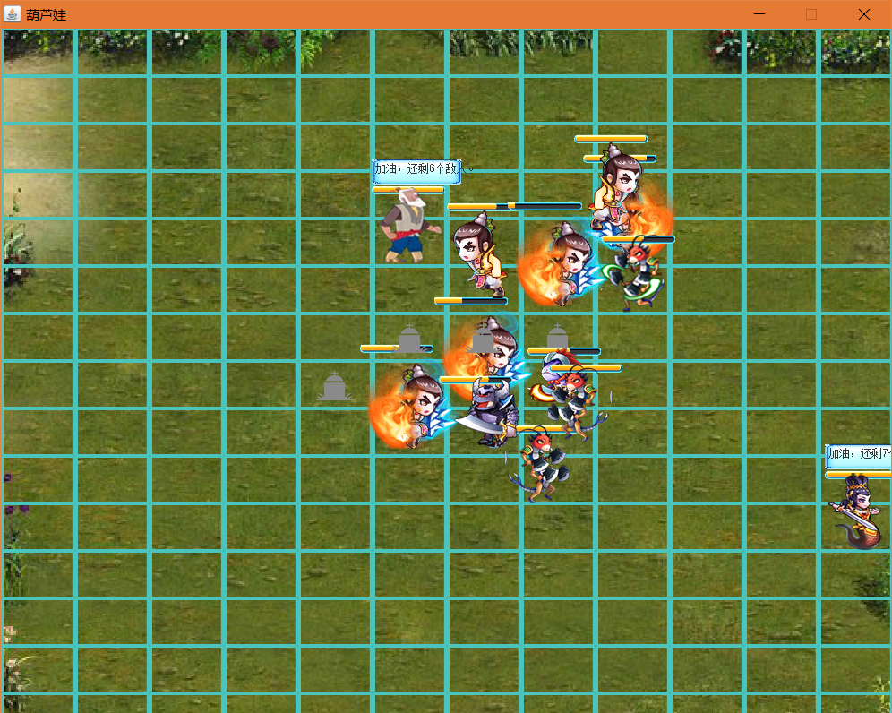
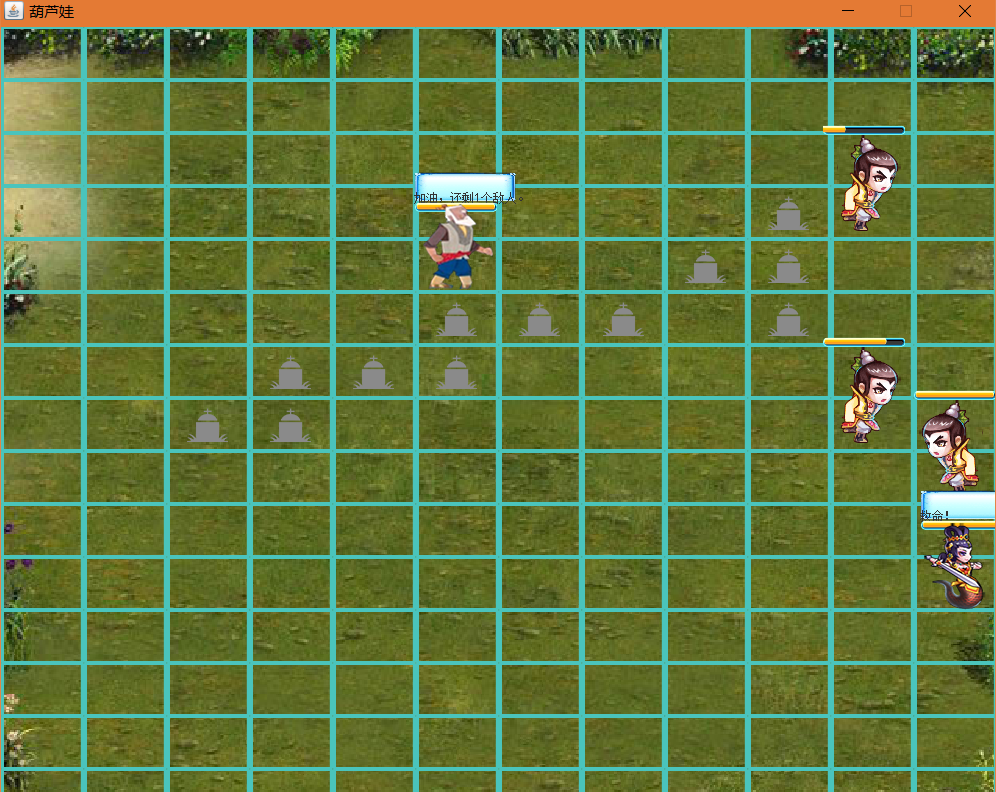
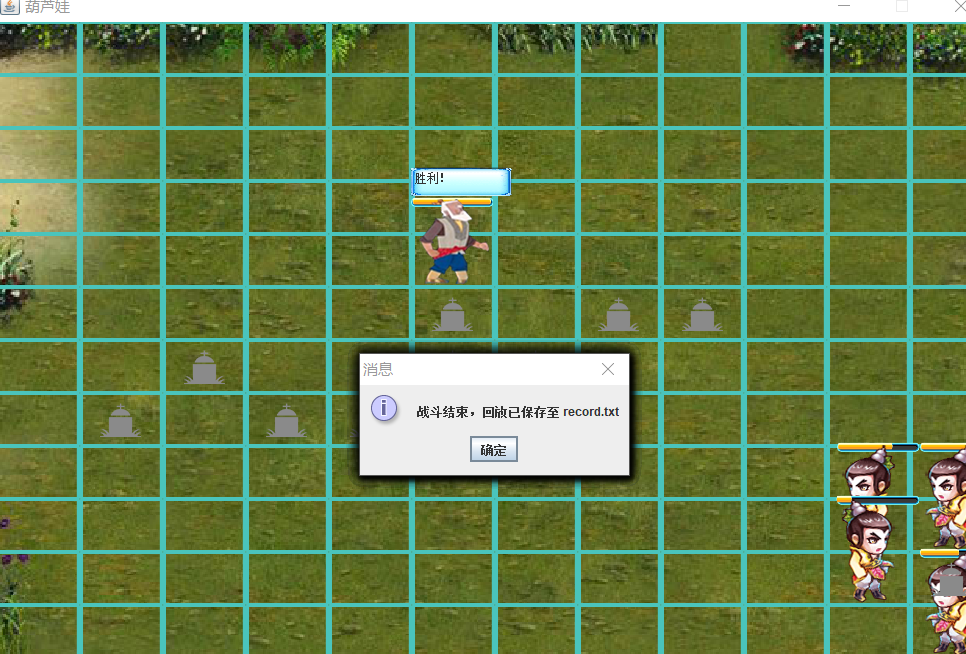
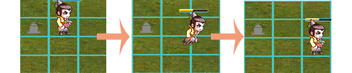
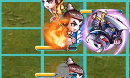
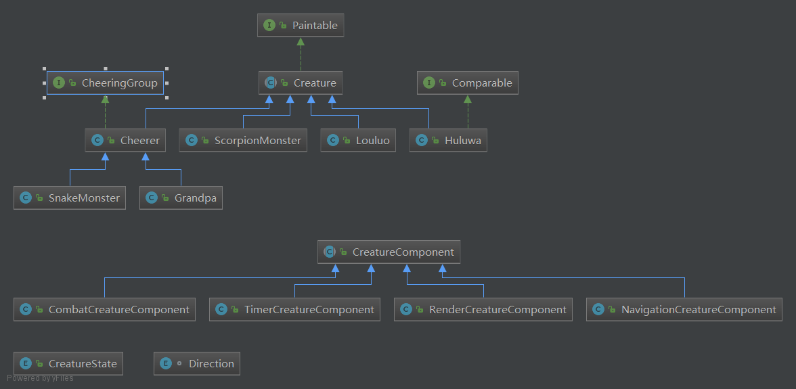

# Final Project
## 运行截图
 
 
 
 
## 功能说明
### 基本功能
按照要求，按下空格后布阵并且开始战斗，在一方全员阵亡后，保存到文件（项目目录/record.txt），按下'L'显示文件对话框选择文件进行回放。
### 功能细节和实现机制
#### 连续动画
连续动画的实现是我这个项目的一个主要的难点。 
用方框画出了所有的position。由于要体现出多线程的机制，所有生物的移动是以position为单位的，但是这样在两个position间移动时是不连续的，但是我想实现连贯的效果，如下图： 
 

实现的机制是：当一个生物移动到另一个position上时，他的坐标立刻改变，但是会启动一个持续0.5秒的动画。在显示的功能模块中实现这样一个函数
>void startAnimationProgressWithDuration(int times, ImageType type, Vector2 startPoint)

这样就可以实现连续的移动动画。 
而连贯动作的显示，则是利用像下面这样的图片： 
 
每次截取显示图片的一部分来显示出连贯的动作。 
。

#### 战斗
攻击也是动态的，实现的机制和上面类似。并且每个人拥有生命值和攻击力。还有相应的血条显示。 

#### 爷爷和蛇精
爷爷和蛇精属于Cheerer类，这个类继承自Creature，可以根据当前的战况显示不同的信息。目前为爷爷和蛇精实现的是：在战斗时显示敌军数量，在友方全部阵亡时显示“救命”，在敌方全灭时显示“胜利”。

### 设计原则和设计模式
#### 代理机制与单一职责
Creature作为一个最主要的类，职责非常多，要在repaint时显示相应的图像，有些还要寻找敌人、攻击等等，为了把这些功能抽象出来，使用了代理机制（也可能叫组件模式，这个想法就是借鉴了某个游戏引擎中的“组件”机制）。 
与此有关的是一个CreatureComponent类，具体来说，可以为生物添加Component，代表相应的功能组件。比如说，
>NavigationComponent: 获取战况以及寻路功能 
RenderComponent: 根据状态选择显示相应的图片 
CombatComponent: 战斗相关的组件 
TimerComponent: 时钟组件 

这样就避免了creature类太过庞大的问题。同时也为可能的功能拓展留下了空间，实现新的Componen就可以添加新的功能。 
 
遗憾之处在于，由于时间有限，尽管花了不少时间去设计，有些地方还是没有很好地遵循依赖倒置原则。如果把完全让Creature类不依赖底层Component的实现，可以拥有非常高的可拓展性。
#### 模型与视图分离
开始做最终的大作业时，就想着尽量采用MVC的架构，但是感觉这个项目里面model和controller的界限不是很明确，所以只是把view和model分了开来，view的功能实现完成后（主要和上述的RenComponent有关），所有跟游戏逻辑有关的就是模型部分了，在实现生物的行为是不用去考虑如何显示的问题。
#### 模版方法
每个生物的线程run()方法都有类似的模式，有一些行为是共有的，而不同的子类又有别的具体的行为，比如葫芦娃这种要攻击的生物就要战斗，而爷爷要加油助威。这里是用了TemplateMethod的设计模式。

### 其他实现细节
#### 战局存储
如上所述，本项目中尝试分离了模型与视图，在实现保存战局功能的时候，也尝试了保存model和保存view两种方式： 
1. 保存模型：在每个生物要进行某种行为时增加一条记录，这样每条记录中就是某个时间点，某个生物，对某个坐标，进行了某种行为（移动或者攻击）；
2. 保存视图：在每个成员要paint时，增加一条记录，这样记录的是在某个时间点，某个矩形区域内，绘制了某个image.

这两种方式分别实现在FieldRecordDele和FieldRcordImageDelegate中，其实都是可行的。但是由于线程执行的顺序时随机的，在播放保存的模型的时候，会由于前后时间次序的差异导致线程不安全的问题。(比如说，本来在10秒的时候移动到这个position是可以的，但是回放时因为次序的差异，10秒时这个position上是有人的，这就造成回放时可能会出现问题) 
所以最终选择了保存视图的方式。但是还是由于线程执行随机的问题，可能在播放时会出现闪烁或者重影。这个没有说明简单的解决办法，毕竟做动画最好还是用定时器。
#### 与position有关的线程安全问题
这个实现起来倒是没什么难度，每个生物要移动前，都是跟NavigationComponent要来的一组可能的目标位置，然后调用attempToMoveTo( Position[] positions )来尝试移动，在这些位置中找到一个没被占据的才会真的移动，判断时对资源上锁，就保证了线程安全。 
### 总结
在这个大作业上还是花了不少时间的，对多线程和图形有了更多的经验，尤其是对面向对象设计方法和设计模式有了更深的理解。而且历经艰难把多线程下的延时动画做出来，还是很欣慰的。 
但是不足之处也挺明显的。我最在意的还是在设计上。最终代码量比预想的要多，结果在项目稍微庞大一些后，有的感觉控制不住（比如两天后就想不起来某个函数是在哪儿被调用的了），究其原因还是总体框架设计得还不够好，有些设计原则没有贯彻到位。
