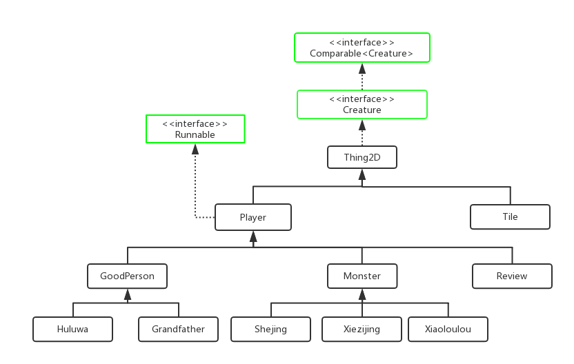

# Java Final Project

- Project: 葫芦娃大战妖精

- Author: 汪值

- ID: 141270037

- Github项目代码: [FinalProject](https://github.com/meikerwang/FinalProject)

----

### 项目环境

- Windows 10

- JDK 1.8.0_144

- Intellij IDEA 2017.2.3

- maven-4.0.0

- junit 4.11

----

### 使用说明

- SPACE空格键: 开始/继续战斗

- S键: 暂停战斗

- L键: 回放功能, 选择文件, 根据文件内容回放

最开始时可以选择 开始战斗 或者选择 回放功能

当战斗结束后可以选择重新开始战斗或者回放功能.

同时当回放结束后也可以重新开始战斗或者回放.

----

### 代码结构简介

- **显示模块** : 基本上就是在实例代码基础上添加各种生物后改成的.

- **生物模块** : 是由类`Thing2D` 及其子类构成

- **回放模块** : 由类 `Review` 构成, 同时调用了Field类中的相关方法, 战斗的回放在 Review.txt 中

----

### 战斗力系统

- 战斗力判定是根据双方的战斗力值生成一个概率百分比, 战斗力越大, 获胜概率越强, 当两者靠近时才会发生战斗.

- 爷爷: 隐藏属性, 3.0

- 大娃: 半肉战士, 力大无穷, 综合能力较强, 9.0

- 二娃: 指挥, 辅助, 非主战力, 千里眼顺风耳, 5.0

- 三娃: 肉坦, 双抗全场第一, 7.0

- 四娃: ADC, 输出爆炸, 脆皮, 10.0

- 五娃: AP法师, 技能特效无敌, 7.0

- 六娃: 刺客, 隐身, 偷袭能力很强, 9.0

- 七娃: 外挂携带者, 团控无敌, 12.0

- 蛇精: AP法师, 20.0

- 蝎子精: AD战士, 15.0

- 小喽喽: 小兵, 2.0

----

### 移动速度

战斗力越强, 基础速度值越高.

速度 = 基础速度 + 随机延时

----

## Version Log

- version 0.1 修改作业3的程序, 并且将 GodIsGod.java 中所有生物站队 改到 Field.java中的initWorld() 中.

- version 0.2 修改所有生物的构造函数, 加入参数Field field, 让所有生物共用同一个field.

- version 0.3 让所有的生物继承 Player 类

- version 0.4 在Field中添加 ArrayList players, 用于存放所有的生物. 将生成的Position二维数组中的生物加入到 player数组

- version 0.5 在Field中添加map二维数组判断指定位置是否有Player, 并且用 ReentrantLock 锁机制进行互斥操作. 添加战斗力属性

- version 0.6 完成战斗功能,和战斗场景的构建 (^_^)

- version 0.7 修复一些bug

- version 0.8 添加JUnit单元测试

- version 0.9 添加战斗回放功能

- version 1.0 葫芦娃大战蛇精正式版本1.0上线

- version 1.1 修复一些bug

- version 1.2 update README.md

