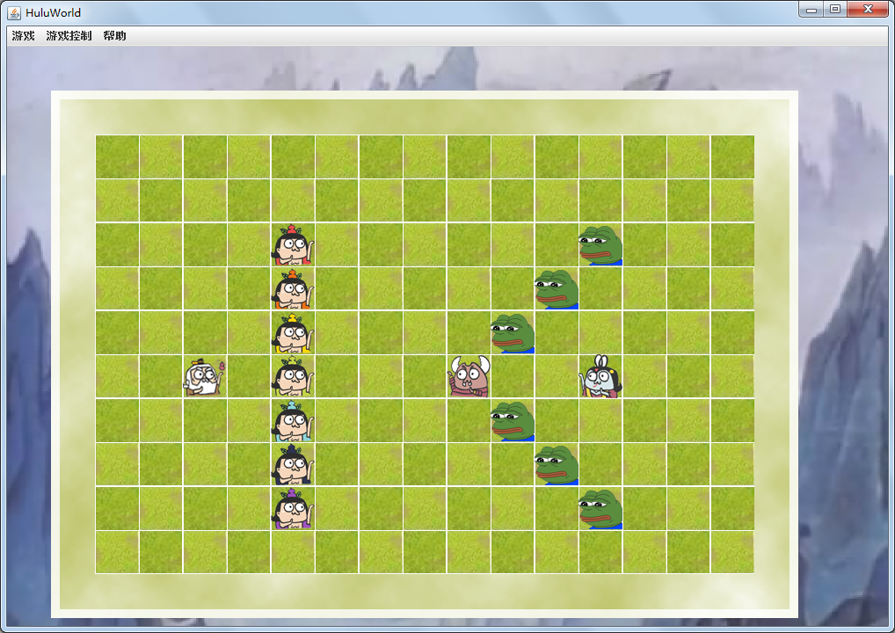
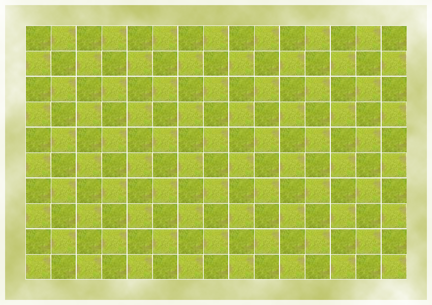

# 葫芦娃期末大作业
**牟星宇 151070053**

## 游戏文件说明  
mvn clean package生成的.jar包在`target`文件目录下。

## 游戏操作说明

1. `空格键` 控制开始游戏（进行一次战斗，当然，得在战斗准备好的情况下）；
2. `P键` 控制进行中的战斗的暂停/继续；
3. `S键`/`L键` 保存/读取游戏记录；
4. `ESC键` 退出游戏；
5. 加入了`菜单栏`，使界面交互更加友好，可以通过点击菜单栏或者快捷键方式控制游戏。（另外还可以查看游戏操作说明和作者信息）

## 游戏界面

游戏初始界面。

以`葫芦山`为背景;

自制战斗场景（类似棋盘~）。

若干葫芦娃、妖怪等图片，请在`src\main\resources\Images`文件夹中查看。

## 游戏设定
设定在这个葫芦世界，所有生物初始拥有一定数值的`生命上限`和`基础攻击`。能对其他生物造成伤害，且数值为为`基础攻击`+一个随机数值；能受到其他生物体的攻击并扣除等量的`当前生命`值，当`当前生命`降低为0时死亡。  
同时，这是一个只有`左右`（0左/1右）的世界，只有当生物体进行左右移动变换时，对应的图标方向才会改变。  
这个世界非常残忍，无论什么生物体，上了战场都要对敌作战，直至一方全部死亡~  

### 具体设定
#### 葫芦娃：  

1. 生命上限：10
2. 基础攻击：5
3. 攻击浮动：11（随机数值范围）
4. 初始方向：1（右）

#### 爷爷（鶸）

1. 生命上限：5
2. 基础攻击：1
3. 攻击浮动：0
4. 初始方向：1（右）

#### 妖怪

妖怪（Monster)的攻击浮动均为5，初始方向均为0（左），但其他数值不相同。

##### 蝎子精、蛇精

1. 生命上限：20
2. 基础攻击：10

##### 小喽啰

1. 生命上限：5
2. 基础攻击：4

由上可见，双方战力还是葫芦娃一方更厉害些，但是由于随机的原因，双方全灭的可能性也是有的（具体可回放`src\main\resources\Records`文件夹中的1,7,10三条记录）。

## 项目文件说明

以Maven项目框架进行构建。

*  `main/resources/Images`文件夹：存放需要的图片信息。
*  `main/resources/Records`文件夹：存放了10条战斗记录，可以回放查看。

## 框架介绍
我一开始没有先分好`package`再码代码的习惯，导致所有的class文件一锅炖。不过后面我还是粗略的划分了几个`package`包。具体如下。  

*  `Creature`包：（定义生物）
	+  `Creature`类： `implements Runnable`，抽象类，定义所有生物体的共同属性和共同方法。
	+  `Brother`类： 定义了葫芦娃的属性。
	+  `Grandfa`类： 单例模式，定义爷爷的属性。
	+  `Monster`类： 定义了妖怪的共同属性，默认构造出小喽啰。
	+  `Shejing`类： 单例模式，定义蛇精的属性，继承自`Monster`。
	+  `Xiezi`类： 单例模式，定义蝎子精的属性，继承自`Monster`。
*  `Ground`包：（定义战场和位置）
	+  `Position<T extends Creature>`类： 定义位置的基本属性。
	+  `BattleGround`类： `extends JPanel implements Runnable`，定义战斗场地的基本属性。
*  `Formation`包：（定义阵型）
	+  `Formation`类：  抽象类，定义阵型的共同属性和抽象方法。
	+  `SnakeFormation`： 定义长蛇阵型及其中生物的位置属性。
	+  `CraneFormation`： 定义雁形阵型及其中生物的位置属性。
*  `Record`包：（定义记录）
	+  `Record`类： 定义一条战斗记录的基本属性。
	+  `RecordPlayer`类： 定义记录播放器的基本属性和方法。
*  `UI`包：（定义用户界面）
	+  `BattleImage`类： 图像工具类，主要用于获取图像信息。
	+  `BattleMenu`类： `extends JMenuBar`，定义菜单栏的基本属性。
	+  `BattleFrame`类： `extends JFrame`，游戏主界面类，定义主界面的基本属性。
*  `Exception`包：（定义异常）
	+  `TooCrowdedException`类： `extends Exception `，自定义的异常类型。
*  `Hulu.Anno`包：（定义注解）
	+  `AuthorAnno`： 自定义关于作者信息的`Annotation`。
*  `ENUM`包：（定义enum）
	+  `COLOR`葫芦娃颜色，`Mname`妖怪名字，这两个均用英文标识，主要便于生物体图像获取。
	+  `NAME`所有生物体的中文名。
	+  `STATE`为`BattleGround`游戏状态的标识。

## 概念、机制和设计理念

### 1.封装、继承
抽象类`Creature`实现了`Runnable`接口，通过`run()`定义了每一个生物体的行动模式，子类有`Grandfa`类，`Brother`类，`Monster`类，分别表示爷爷、葫芦娃和妖怪。`Monster`类默认构造小喽啰，子类有`Shejing`类和`Xiezi`类，分别表示蛇精和蝎子精。

### 2.多态
`Creature`类中定义的`damage()`方法，不同子类有不同的实现方式；`Formation`类中定义的`initial()`方法，不同子类有不同的实现方式。

### 3.单例模式  

为更加接近实际情况，蛇精、蝎子精和爷爷实现时均为懒汉式单例模式。便于对具体实例的控制，具有灵活性。因为只有`BattleGround`对其初始化，就没有体现线程安全了。

### 4.设计原则

#### 单一职责原则
*  `Creature`类只负责生物体的定义。
*  `Position`类只负责位置信息的定义。
*  `Record`类只负责记录信息的定义。
*  `RecordPlayer`类只负责对记录信息操作的定义。
*  `BattleMenu`类只负责窗口菜单栏的定义。
*  `BattleImage`类只负责对图像的操作。
*  `BattleFrame`类只负责游戏框架信息的定义。

#### 里式替换法则
所有的*Creature*都能被其子类替换，如`Monster`、`Brother`和`Grandfa`等。所有的*Formation*都能被妻子类替换，如`SnakeFormation`等。

#### 开放封闭原则
所有类属性均设置为私有，仅对外提供必要的接口以获取或修改数据。保证代码的灵活性、可重用性、可维护性。

### 5.集合与泛型

#### ArrayList
`BattleGround`类中定义两个属性  
    
	private ArrayList<Formation> formations;   
	private ArrayList<Creature> creatures;  

使用集合`ArrayList`，分别储存放入战场的生物信息和阵型信息。  
`Formation`类中定义属性

	protected ArrayList<Creature> creatures;
用于存入阵型中的生物信息。
`RecordPlayer`类和`BattleGround`类中定义属性

	private ArrayList<ArrayList<Record>> records;
用于对每一次行动的记录表进行存储。

#### 自定义泛型Position

`Position<T extends Creature>`储存一个位置坐标信息，而定义其为泛型，`holder`属性只能为一个生物体。

## 输入输出

*   `Record`类：`implements Serializable`， 定义为可序列化对象，利用`ArrayList`类也可序列化从而可以将`ArrayList<ArrayList<Record>>`对象写入和读出文件。  
*   `File`类：用于获取文件。游戏中主要由`BattleFrame`类中使用`JFileChooser`类弹出文件选择框获取对象。  
*  `ObjectInputStream`类/`ObjectOutputStream`类： `File`对象传入`RecordPlayer`对象后，通过修饰器转化为这两种类的对象进行对象向文件的读写。  

## 线程安全

*  `Creature`类
	+  `move()`方法中，更改`Position`信息时，对当前`Position`以及将要移动到的`Position`都以`synchronized`修饰，以保证只有一个线程的生物能同时移动到同一位置。
	+  `run()`方法中，与相邻敌对生物战斗时，将自己和敌对生物都用`synchronized`修饰以保证每次生物都只与一个敌对生物发生战斗（造成伤害和受到伤害）。
	+  `wounded()`和子类中`damage()`方法用`synchronized`修饰，保证生物不能同时被多个线程（生物体）调用造成伤害和受到伤害。

*  `Position`类
	+  `setHolder(T holder)`方法用`synchronized`修饰，保证同一时间只有一个线程能调用。
*  `BattleGround`类
	+  `setState(STATE state)`方法用`synchronized`修饰，保证同一时间只有一个线程能修改游戏状态。

## 线程协作

#### 游戏暂停机制
`Creature`类`run()`方法中

	synchronized (this){
                while(this.isPause()){
                    try{
                        wait();
                    }catch (Exception e){
                        e.printStackTrace();
                    }
                }
            }
用以判断游戏是否暂停。相对应的`BattleGround`类`pauseAll()`方法

	public void pauseAll(){
        if(state == STATE.RUNNING){ this.setState(STATE.PAUSE);}
        else if(state == STATE.PAUSE){this.setState(lastState);}
        else return;

        for(Creature creature:creatures){
            creature.reversePause();
            synchronized (creature){
                creature.notifyAll();
            }
        }
    }
用以暂停/继续战场上的生物体线程。

## 单元测试

单元测试比较简陋，主要对自定义的`TooCrowdedException`异常进行测试，即对`BattleGround`类进行测试，共10个单元测试。  

*  `layout(Creature, Position)`
*  `layout(Formation, Position)`  

对以上两个方法的抛出异常的测试。

*  `conflicts(Position position)`
*  `conflicts(Formation formation)`
*  `alreadyLaid(Creature creature)`
*  `alreadyLaid(Formation formation)`

对以上四个方法`assertTrue()`测试。

## 注解
注解也比较简陋，仿照老师上课讲的定义了`@AuthorAnno`注解，用于储存作者的信息。具体定义如下

	@Documented
	@Target({ElementType.TYPE, ElementType.METHOD})
	@Inherited
	@Retention(RetentionPolicy.RUNTIME)
	public @interface AuthorAnno {

    	//作者信息
    	String name();//姓名
    	int studentNum();//学号
    	String department();//院系
    	int revision() default 1;
	}
## 结语

首先，非常感谢老师能够阅读到这里！

然后，请允许我对这学期这门课进行吐槽。不得不说，跨专业选的这门java课简直要了我的老命，早知道就退课了(꒪Д꒪)ノ（不过现在后悔已经晚了orz。大作业肝了我好久，我充分明白了写代码是一个从0到1的过程。

不过通过这门java课，我确实也学到了不少编程方面的知识，比如如何真正的面向对象等~非常感谢两位老师辛勤的授课（老师课上课下都散发着逗逼的气息，皮这一下你开心吗）。大作业肝得我生不如死，终于做完了，好了我去复习去了_(:з」∠)_（考试的情况希望老师手下留情orz）。 

