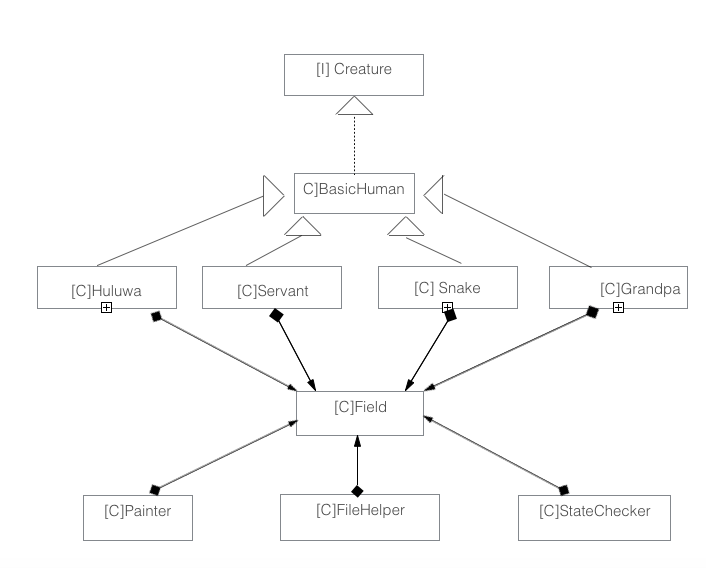
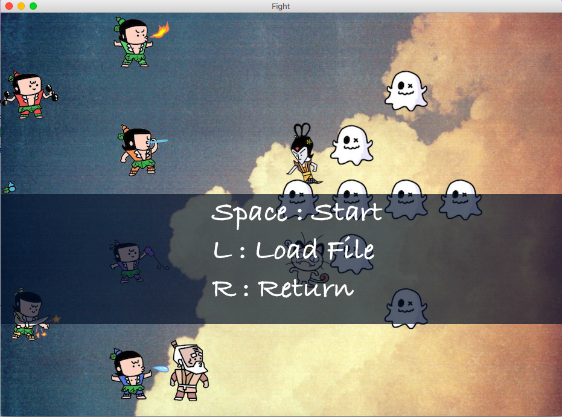
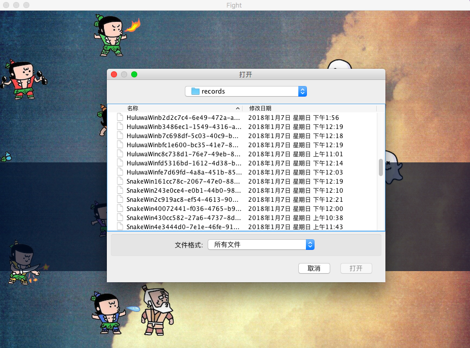
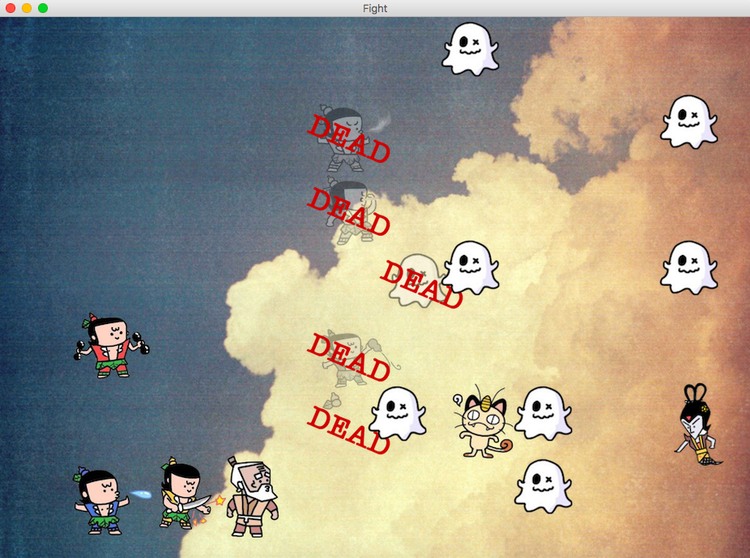
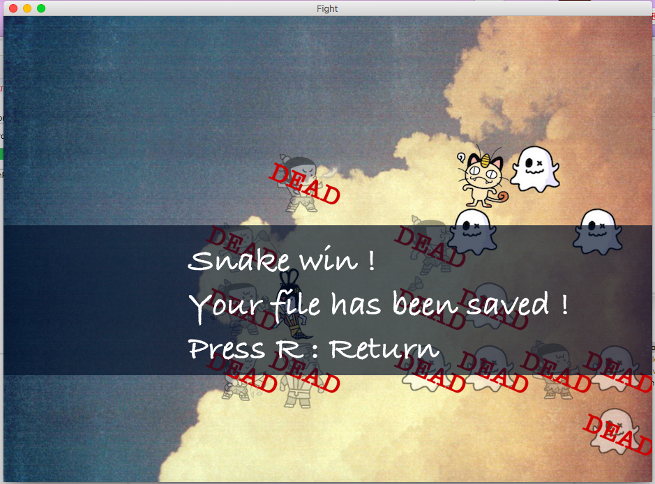
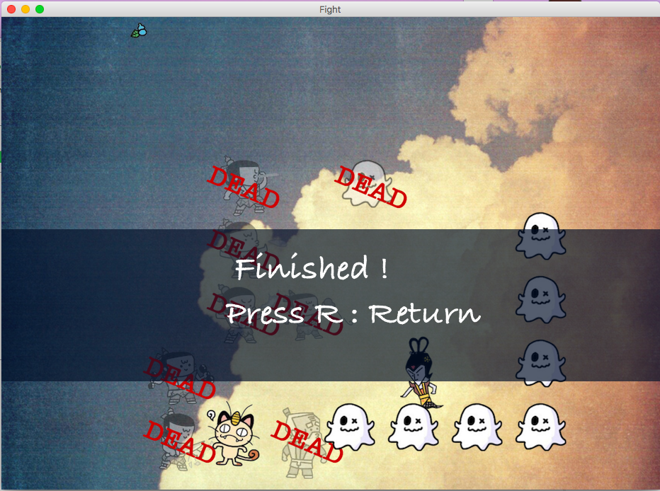

# 期末大作业葫芦娃

## 操作说明
* mvn clean test package后目标jar包为hulu-0.0.1-SNAPSHOT.jar
* 战斗记录为Sample.rec,运行时在按L出现的文件选择界面选择即可
* 空格键开始游戏
* L 键选择文件
* R 键返回开始阵列

### 注意
* 若未选择文件或文件类型选择错误，对话框关闭后将返回开始界面
* 在战斗中途按R键返回后之前战斗记录也会保存，为unfinished*****.rec
* 战斗结束后记录自动保存，为HuluwaWin*****.rec或SnakeWin****.rec 文件保存地址为target/records

## 主要类间关系

## 主要类说明
* Creature ：定义生物的接口
* BasicHuman :实现部分Creature定义的接口,这是所有生物的共有行为,实现Runnable接口
* Huluwa,Snake…….:具体生物，继承BasicHuman实现其他Creature定义的接口
* Position : 二维空间单位面积类，可返回当前坐标和当前位置上的生物
Field ：战场，负责准备背景，加载葫芦娃和蛇精两方人员，追踪和打印战况，接收键盘指令，有三位工作人员：StateChecker,Painter,Recorder负责战斗整体层次的功能。
  * StateChecker：  Field 私有类，负责检查战场状态，在一方全部死亡时改变战场状态
  * Painter： Field私有类，负责打印战况
* Recorder : 记录员类，在每次打印战况时记录当前战况
* FileHelper ：通过序列化和反序列化保存和读取记录文件，根据存储时战场状态决定文件名头“unfinished”,”SnakeWin””HuluwaWin”,后缀为.rec,读取时会检查文件类型
* positionSetter ：排列阵型，根据样式排列队形
* FengShi,ChangShe,Chonge: 继承PositionSetter 提供排列整列样板，进行具体队列排布
* Judge : 当两方人员相遇时判断胜负，规则：若实力相差2个等级则实力高一方获胜，否则随机判断获胜方
* State ：枚举类型，有ALIVE,DEAD,END 指明当前生物状态，在run 函数中每次循环检查当前状态，若为DEAD 或END则退出循环结束当前线程。

## 其他说明
* 战场状态：started指明是否开始了战斗或重放，completed指明是否战斗或重放结束，previousfight指明是否是重放模式
* 战场开始后存在的线程：葫芦娃蛇精两方人员各自线程，statechecker一个线程，painter一个线程
* 多线程中上锁函数：setPosition,一次只能一个线程进入，放置同一个位置出现两个生物或在无生物的情况下引用生物的错误
* 攻击距离判定：当前位置周围一圈8个位置
* 战斗力排序：爷爷<小喽啰<猫<葫芦娃<蛇精 移动速度：爷爷<小喽啰<猫<蛇精<葫芦娃

## 测试
* testwithinRow:因为位置是用一维ArrayList 管理的，因此在移动时使用withinRow判断防止出现从屏幕下方直接移动一格到屏幕上方的情况。该测试函数遍历大量可能出错的情况测试withinRow是否能够全判断出来。
* testStartFight: 批量模拟战斗（100场），测试多线程运行时是否会出现错误，因为该测试耗时较长，上交版本中注释掉了该测试。

## 运行截图
* 开始界面

* 选择文件

* 战斗中

* 战斗结束（胜利）

 * 回放结束
 

