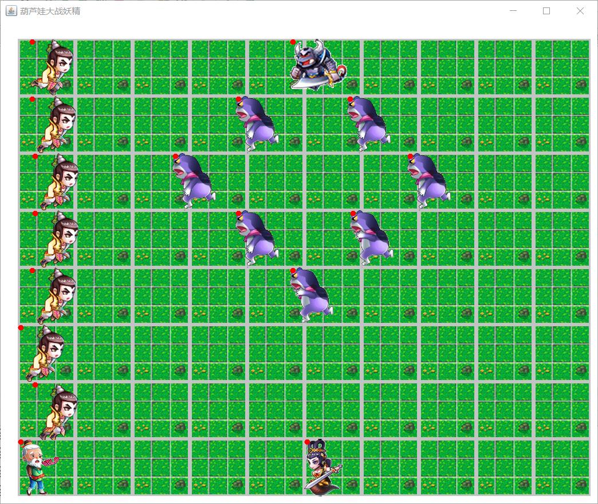
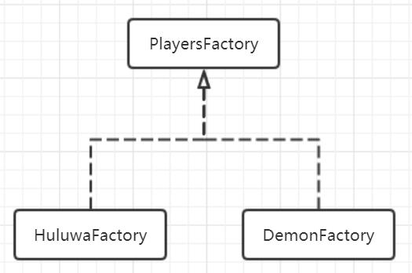
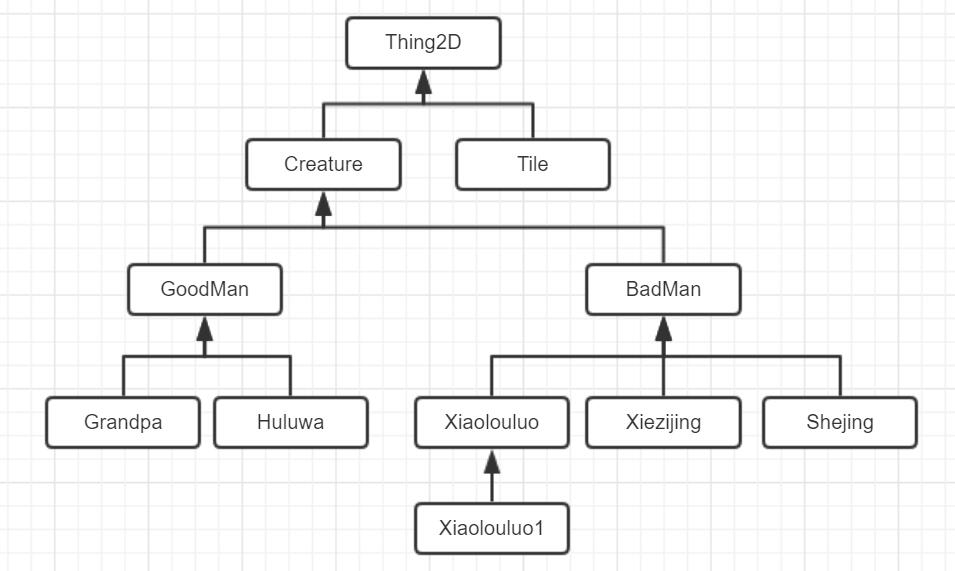

# 葫芦娃大战妖精

## 概述

​	这是一个基于JAVA的图形化应用，主要功能是展现葫芦兄弟大战蛇精蝎子精的场面，同时配有录像回放功能，能够回看大战的精彩场面。在这里，葫芦娃一方和妖精一方将进行一场惊天动地的大战，最后将有且只有一方获得胜利。


## 操控方法

- 按`空格`开始大战，同时录制文件`record.txt`保存在工程目录下
- 按`L`键读取录制文件`record.txt`，进行回放功能


## 精彩回放

​	很久很久以前，世界上本来什么都没有，突然有一天上帝突发奇想，决定根据一个不知从哪里听来的《葫芦兄弟》的故事，来重温葫芦娃大战妖精的精彩场面。于是上帝大笔一挥，啪啪啪，世界上凭空多了一篇草地和一群葫芦娃；上帝又大笔一挥，砰砰砰，又多了一个蝎子精和它带领的一群小弟。双方分别站成**长蛇**和**方门**阵型，上帝还不满意，于是又给两方分别加了老爷爷和蛇精，给各自的队伍加油鼓劲。



​	上帝一声令下，双方战斗很快开始，所有人跑动起来，寻找最近的一个敌人，然后激烈地攻击对方。葫芦娃们使出了看家本领——流星拳，而蝎子精和小喽啰也不甘示弱，拿起砍刀袭击葫芦娃们。

​	经过激烈的战斗，最后妖精们获得了胜利，看来葫芦娃们还需要努力啊。


## 创建生物体

### 工厂模式

>**工厂方法模式**（英语：**Factory method pattern**）是一种实现了“工厂”概念的[面向对象](https://zh.wikipedia.org/wiki/%E9%9D%A2%E5%90%91%E5%AF%B9%E8%B1%A1)[设计模式](https://zh.wikipedia.org/wiki/%E8%AE%BE%E8%AE%A1%E6%A8%A1%E5%BC%8F_(%E8%AE%A1%E7%AE%97%E6%9C%BA))。就像其他[创建型模式](https://zh.wikipedia.org/wiki/%E5%89%B5%E5%BB%BA%E5%9E%8B%E6%A8%A1%E5%BC%8F)一样，它也是处理在不指定[对象](https://zh.wikipedia.org/wiki/%E5%AF%B9%E8%B1%A1_(%E8%AE%A1%E7%AE%97%E6%9C%BA%E7%A7%91%E5%AD%A6))具体[类型](https://zh.wikipedia.org/wiki/%E7%B1%BB_(%E8%AE%A1%E7%AE%97%E6%9C%BA%E7%A7%91%E5%AD%A6))的情况下创建对象的问题。工厂方法模式的实质是“定义一个创建对象的接口，但让实现这个接口的类来决定实例化哪个类。工厂方法让类的实例化推迟到子类中进行。”

​	在本次实验中，实现了`PlayersFactory`的抽象类，并且使用`HuluwaFactory`和`DemonFactory`作为其抽象方法的实现。

```java
abstract  Creature[] create(Field field, Thing2D start, int space);
```



​	创建好工厂类后，只需要填入要求的阵容类型，然后调用create方法，就会生产出相应的Creature和他们对应的位置信息。从而实现了创建对象和具体对象类型的解耦。


## 代码复用

### 类继承

​	为了达到代码复用的目的，为此使用`extends`关键字来实现[继承机制](https://zh.wikipedia.org/wiki/%E7%BB%A7%E6%89%BF_(%E8%AE%A1%E7%AE%97%E6%9C%BA%E7%A7%91%E5%AD%A6))。以`Creature`为例，`GoodMan`和`BadMan`都将继承Creature，这是因为这两个类的代码由大量重复之处，唯一的不同是他们判断敌人的方法不同，那么我们只需要在它们各自的类里实现不同的判断函数，剩余的所有操作仍然由上层的父类进行。这样子避免了大量重复代码的出现，体现了良好的一致性、可维护性、封装性。
### UML类图




## 多线程

###一个生物体，一个线程

​	每一个`Creature`在继承自`Thing2D`的基础上，还会实现`Runnable`接口，也就是说，每一个生物体，都可以是一个独立的线程来运行。值得注意的是，JAVA不支持多继承，但是支持多接口。

```java
abstract class Creature extends Thing2D implements Runnable{
	...
	@Override
	public void run(){
		...
	}
	...
}
```


### synchronized关键字

​	使用`synchronized`关键字，能够对一个对象加对象锁，到达安全并发访问的目的。在本实验中，对`Tile`加对象锁，确保当一个`Creature`打算从一个地砖跳到另一个地砖时，只有当前一个线程在访问这个地砖对象，防止两个线程同时访问一个地砖对象时，发生难以预料的结果。

```java
synchronized (tile) { ... }
```


### GUI线程

​	为了确保页面刷新均匀流畅，在这里专门开启一个**Timer**的定时器，每隔一段时间（大约是100ms）就发送一个重绘屏幕的命令，这样人眼看到大约每秒10次的刷新，就感觉GUI界面是在不断运动、刷新的。

```java
Timer timer = new Timer(100, new ActionListener() {
	public void actionPerformed(ActionEvent e) {
		field.repaint();
	}
});
timer.start();
```

​	或者我们可以使用[LAMBDA](http://www.oracle.com/webfolder/technetwork/tutorials/obe/java/Lambda-QuickStart/index.html)表达式来实现同样的事：

```java
Timer timer = new Timer(100, (e) -> field.repaint()});
timer.start();
```

 

## 让葫芦娃跑动起来

### ImagePlayer 类

​	为了实现葫芦娃跑动的动画效果，引入`ImagePlayer`类，其本质上是一个`Image`类的集合，存放着一系列动作的图片，同时还有一个内部的状态来记录当前的图片索引。每次从`ImagePlayer`中读取一张图片出来的时候，一方面会返回当前的图片，同时会更新这个内部状态，使其指向下一帧图片，这样外部在不断获取这个对象的图片时，实际上获取到的是一系列图片，从而形成了葫芦娃跑动的动画。


​	基于同样的道理，我们也可以播放葫芦娃的战斗动作。


## IO

### 响应键盘中断

#### 观察者模式

>**观察者模式**是[软件设计模式](https://zh.wikipedia.org/wiki/%E8%BB%9F%E4%BB%B6%E8%A8%AD%E8%A8%88%E6%A8%A1%E5%BC%8F)的一种。在此种模式中，一个目标对象管理所有相依于它的观察者对象，并且在它本身的状态改变时主动发出通知。这通常透过呼叫各观察者所提供的方法来实现。此种模式通常被用来实时事件处理系统。

#### 适配器模式

>在[设计模式](https://zh.wikipedia.org/wiki/%E8%AE%BE%E8%AE%A1%E6%A8%A1%E5%BC%8F_(%E8%AE%A1%E7%AE%97%E6%9C%BA))中，**适配器模式**（英语：adapter pattern）有时候也称包装样式或者包装(wrapper)。将一个[类](https://zh.wikipedia.org/wiki/%E7%B1%BB_(%E8%AE%A1%E7%AE%97%E6%9C%BA%E7%A7%91%E5%AD%A6))的接口转接成用户所期待的。一个适配使得因接口不兼容而不能在一起工作的类能在一起工作，做法是将类自己的接口包裹在一个已存在的类中。

#### 缺省适配器模式

>**缺省适配器模式**是适配器模式的一种变形，应用也很广泛。当不需要实现一个接口提供的所有方法时，可以先设计一个抽象类实现该接口，并为接口的每个方法提供一个默认的实现（空方法），这样抽象类的子类就可以根据需要去覆盖父类的某些方法，而不需要实现所有的方法。

​	创建`TAdapter`类，继承自`KeyAdapter`，而`KeyAdapter`是一个**缺省适配器**，这里我们只实现按键按下响应的事先处理函数。

```java
class TAapter extends KeyAdapter {
	
	@Override
	public void KeyPressed(KeyEvent e) {
		...
		int key = e.getKeyCode();
		
		if(key == KeyEvent.VK_SPACE) {
         	...
		}
		...
	}
}
```

​	然后在将这个`TAdapter`类创建的对象注册给Field，这样用户界面就能接受来自键盘的响应了。值得注意的是，这里我们主要使用了观察者模式，也就是说TAdapter作为观察者观察着Field对象，被观察者Field一有键盘中断，TAdapter会第一时间知道，并且做出相应的响应动作。

```java
// Field.java
Class Field {

  	public Field() {
		...
		addKeyListener(new TAdapter());
	}
	...
}
```


### 文件输入输出

#### 装饰器模式/修饰模式

> **修饰模式**，是[面向对象编程](https://zh.wikipedia.org/wiki/%E9%9D%A2%E5%90%91%E5%AF%B9%E8%B1%A1%E7%BC%96%E7%A8%8B)领域中，一种动态地往一个类中添加新的行为的[设计模式](https://zh.wikipedia.org/wiki/%E8%BD%AF%E4%BB%B6%E8%AE%BE%E8%AE%A1%E6%A8%A1%E5%BC%8F)。就功能而言，修饰模式相比生成[子类](https://zh.wikipedia.org/wiki/%E5%AD%90%E7%B1%BB)更为灵活，这样可以给某个对象而不是整个类添加一些功能。

​	由于需要实现回放功能，需要将播放过程中葫芦娃和妖精的一举一动都输出保存在文件中，而回放也需要从文件中重新读取动作信息，而这些涉及文件的读写功能，也就不可避免的涉及到装饰器模式。

```java
BufferedReader br = new BufferedReader(new FileReader(file));
```

​	这就像一个礼物箱一样，一层层包装着，最后包装成满意的外观。


## 工具类

​	由于JAVA不像C++，所有的函数都需要在类内定义，而有些函数确实又与对象无关，在这里于是很自然将这些函数提取出来，放在一个单独的工具类`LittleUtils`中。这个类中所有的方法都是`static`修饰的，也就是所谓的静态方法。比如说我定义了一个计算两个Creature之间距离的静态方法distance，其接受两个Creature作为参数，然后返回它们的距离。这样函数的存在大大减少了整个工程类似代码的产生，而且语义明晰，也方便维护。如果我想改变距离的计算方法，那么只需要修改工具类中的该方法就可以了。


## 测试

​	在这里使用了JUnit对项目进行单元测试，测试了一下`LittleUtils`中两个生物体距离的计算，结果通过了测试，说明代码还是没有问题的。


*EOF*


